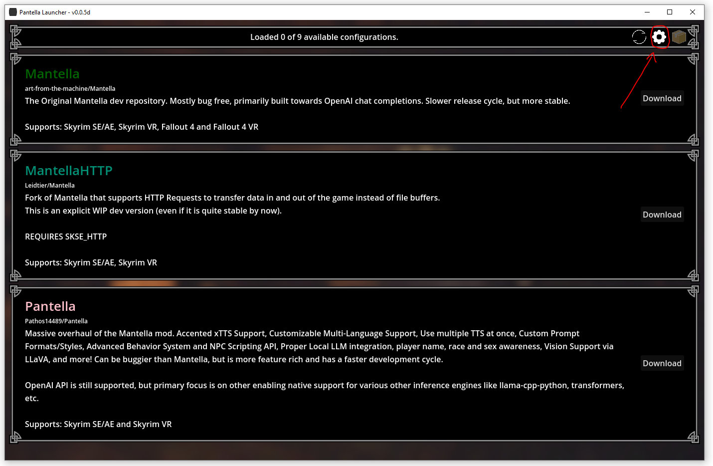
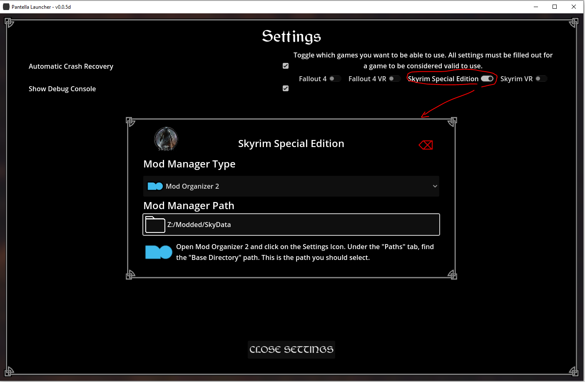
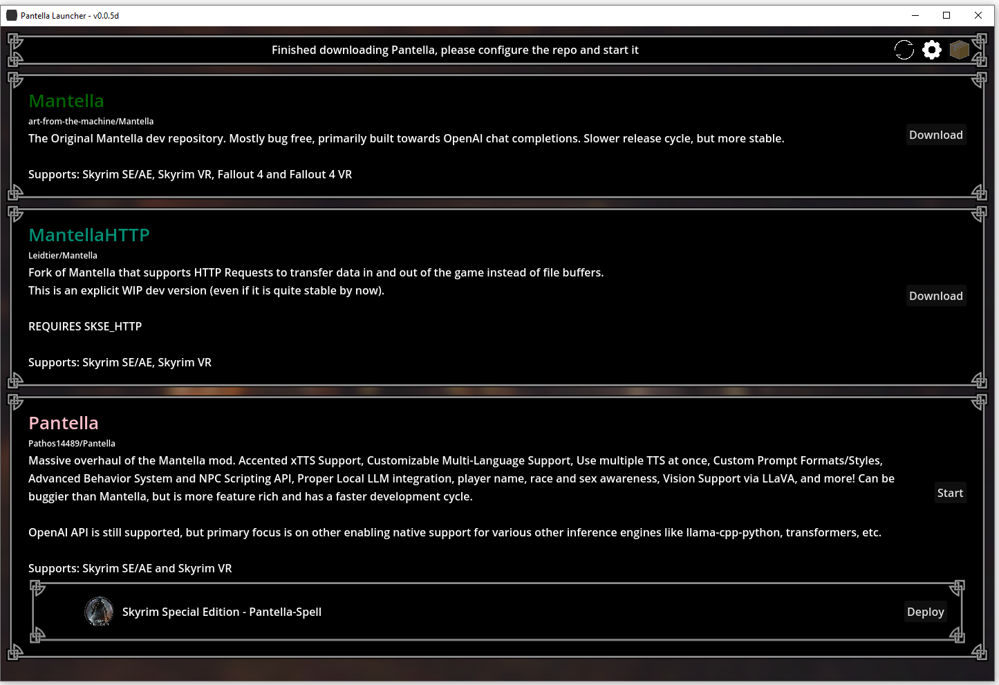
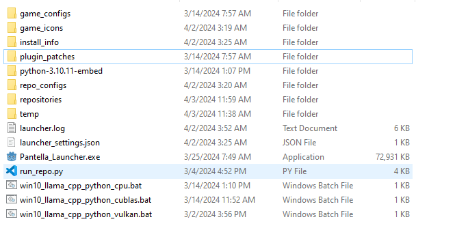
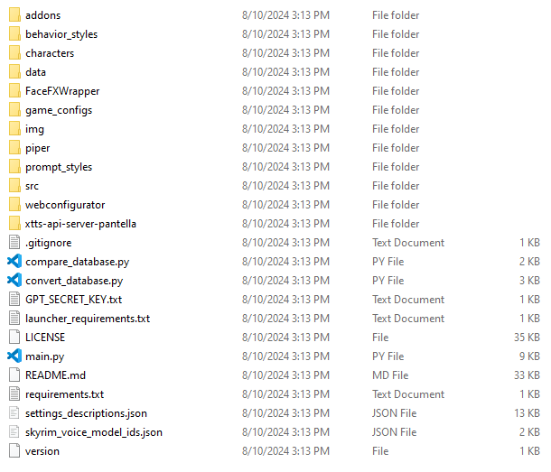
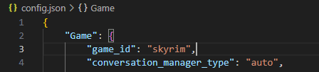

<br clear="right"/>
<br clear="right"/>

Pantella is a fork of the popular Skyrim/Fallout mod Mantella, which allows you to naturally speak to NPCs using Speech-to-Text or Text Input, various LLM inference backends/OpenAI API Compatible (text generation), and half a dozen Text to Speech options.

## Key Features
- Interact with 1,000+ NPCs, all with their own unique backgrounds (or [add your own](#adding-new-npcs))
- Support for local (eg Llama 2, 3, 3.1, Gemma, etc.), OpenAI (GPT-4, 4o, etc.), and OpenRouter (Toppy-M 7B, various other LLMs from dozens of providers, including Anthropic, Meta, OpenAI, etc.) language models
- Compatibility with 20+ languages  and support for changing the whole prompt sent to the LLM with the prompt_style settings to the desired language. This should improve the quality of the responses from the LLM when using a language other than English.
- NPCs remember past conversations with you (better than before!)
- NPCs are aware of in-game events, remember them long term, and can take action based on them during conversations
- Vision support for vision based LLMs, both local and cloud based
- Fully playable in Skyrim VR / SE / AE

# Table of Contents
- [Preface - "What's different from Mantella?"](#preface---whats-different-from-mantella)
	- [ChromaDB Memory Manager](#chromadb-memory-manager)
	- [New Behavior System](#new-behavior-system)
	- [Proper Narrative Roleplay Support](#proper-narrative-roleplay-support)
	- [Add-On System](#add-on-system)
	- [Modular Design](#modular-design)
	- [New LLM Backends](#new-llm-backends)
	- [New TTSes](#new-ttses)
	- [Single Prompt Chain-of-Thought Support](#single-prompt-chain-of-thought-support)
	- [Automatic Character Generation](#automatic-character-generation)
- [Things to Consider Before Installing...](#things-to-consider-before-installing)
	- [Hardware Requirements](#hardware-requirements)
	- [Storage Requirements](#storage-requirements)
	- [Compatibility](#compatibility)
  	- [Skyrim Install Location](#skyrim-install-location)
	- [Do you want to use xVASynth? (Optional)](#do-you-want-to-use-xvasynth-optional)
	- [Required Skyrim Mods](#required-skyrim-mods)
	- [Optional Recommended Skyrim Mods](#optional-recommended-skyrim-mods)
	- [Picking Your Inference Engine and Language Model (Optional)](#picking-your-inference-engine-and-language-model-optional)
- [Installation](#installation)
	- [1 - Getting Started - Installing the Launcher](#1---getting-started---installing-the-launcher)
	- [2 - Configuring the Launcher](#2---configuring-the-launcher)
	- [3 - Configuring Pantella - Games](#3---configuring-pantella---games)
	- [4 - Run Pantella...? :/](#4---run-pantella-)
	- [5 - Configure LLM Settings](#5---configure-llm-settings)
	- [6 - Configure Speech Recognition Settings](#6---configure-speech-recognition-settings)
	- [7 - Configure TTS Settings (Optional)](#7---configure-tts-settings-optional)
	- [8 - Configure Vision Settings (Optional)](#8---configure-vision-settings-optional)
	- [9 - Run Pantella :)](#9---run-pantella-)
- [Troubleshooting](#troubleshooting)
	- [ChromaDB Memory Editor](#chromadb-memory-editor)
	- [General Issues Q\&A](#general-issues-qa)
	- [xVASynth Issues Q\&A](#xvasynth-issues-qa)
- [Development](#development)
	- [Adding New NPCs](#adding-new-npcs)
	- [Running with venv](#running-with-venv)
	- [Running without venv](#running-without-venv)
	- [Running with the Launcher (For developers)](#running-with-the-launcher-for-developers)
- [Attributions](#attributions)

# Preface - "What's different from Mantella?"
Pantella has been more or less redesigned from the ground up forked from Mantella v0.11. A lot of the systems have been broken out into generic modules to make it easier for developers to add new LLM backends, change how conversations are stepped through, etc., without having to redo any of the work for the parts they don't want to replace. It also gives end users much finer control over the exact shape of the prompt sent to the LLM with the prompt_style settings. xTTS and PiperTTS are both included with Pantella by default, and the launcher has been pre-setup to cut out any preparation steps. xVASynth is currently the only TTS that requires extra steps to get working because I can't include it by default.

### ChromaDB Memory Manager 
Pantella has a completely new memory system that depreciates the old summary memory. The new memory uses chromadb to more or less sort everything you've ever said to an NPC into the most relevant chunks of memories. No more lossy summaries that forget details because the LLM doesn't know to include them/can't shove everything into one paragraph.

### New Behavior System
Pantella also has a completely revamped NPC behaviors system that has been made as easy to program for as possible to let the NPC choose to do more complex actions than the pre built "Follow" and "Attack" behaviors from Mantella. Lemme know if you want details on how to make your own behaviors. Pantella Spell also implements an Actor API to let the python behaviors control the Actor in game, though this only runs when the NPC next speaks.

### Proper Narrative Roleplay Support
Pantella additionally has completely reworked generation processing to basically read the output text and figure out which chunks should be spoken by the NPC and which chunks should be read by the new Narrator, which reads roleplayed actions in asterisks by default but can be set to other roleplaying styles in settings. The Narrator is completely customizable, and can be disabled if you prefer the old Narrator-less experience. But I recommend giving it a shot, it's very Baldur's Gate 3-y.

### Add-On System
And Pantella also just got a new add-on system to let other mod authors create self contained patches for Pantella to add voice models and character entries without having to tinker around in the source much, remember where the models should go for each TTS, etc. Just drop in the add-ons folder and it should work. This is the most recent addition though and it's a bit buggy and not feature complete but I still think it's cool and worth mentioning.

### Modular Design
Almost every part of Pantella, from the LLM backend to the TTS backend to the memory system to the behavior system, even the game_interface which is used to interact with the game, is broken out into its own module that can be replaced with a new module that follows the same interface. This makes it easy to add new features to Pantella without having to redo any of the work for the parts you don't want to replace and is the main reason I'm able to add so many new features so quickly. Want to add support for another game? Replace the game_inferface and get the right characters in your characters directory and there you go. New LLM just dropped and I haven't had time to add it? Adding it yourself from documentation isn't that hard and I'd love to help walk you through how I'd do it if you get stuck(plus if it works, you should PR it <3).

<b>Note</b>: There is still some work to be done to make the game_interface more generic, but it's a start. The character_manager class is also a bit of a mess and could use some work to make it more generic for example, this is definitely still an in progress change still due to the scope of the project.

### New LLM Backends
No more just OpenAI API compatible servers, if you have the computer to run it, you can run the LLM directly in Pantella itself. No 3rd party software or setup required, it works out of the box. llama-cpp-python is built in and allows running GGUF models natively in Pantella. There's also support for running transformers models directly through Pantella. If someone wanted to add vLLM support, or exllama, or any other LLM backend, it would be as easy as adding one new file, updating the requirements.txt with any new packages that are requireda and adjusting the config_loady.py file to add any new config settings. Feel free to ask in the Discord if you have a backend you want to add and I can help you get started. Additionally, there is some support for vision based LLMs now as well.

### New TTSes
Pantella comes with added support for three new TTSes compared to Mantella. Additionally, multiple TTSes can be loaded at once and used in a fallback order. Including the ones in Mantella v0.12, here is a semi-sorted total list of all available TTSes in Pantella with their pros and cons, sorted by what I believe to be least to most useful:
- <b>ChatTTS</b> is a relatively new TTS that is fairly unstable in my testing, but sounds really good and has the capability to laugh. The developers were actively working on it while I was adding support for it, and I built my support around a specific dev branch commit that I knew worked. But I hope over time it will become more stable and more feature complete. It's also the only TTS that can laugh, which is pretty cool I think, and they have emotion control on the roadmap as well. It can be sampled on a short sample between 5-15 seconds with decent quality, but the sample requires a written transcription and it has a specific format it likes to use. Some samples I've tried just outright refused to output any voices, so not quite consistent. There's a basic formatter built in, but I don't think it's the final formatter it will use long term, it's just what I got working that seems okay so far.
- <b>ParlerTTS</b> A TTS from Huggingface. It's a bit of a stange one, this TTS doesn't require a voice sample to make a new voice, it requires a text description of the voice you want it to sound like. Including stuff like "Noisy audio" "Clear audio", etc. So Example: "A voice that sounds like a young woman with a clear voice and a slight accent". It's a bit of a strange one, but I could see it being useful if someone wanted to add and customize the voice for a custom NPC without having to go find a clear good quality voice sample of the voice they want to use.
- <b>PiperTTS</b> is a fast and really easy to run on most computers. It doesn't require special hardware like a CUDA enabled GPU, runs on CPU, and I've ever managed to run it on my phone via Winlator. It's not the highest quality TTS in my opinion, but it's enabled by default because everything needed to run it is included with Pantella and it's the easiest to run in general.
- <b>xVASynth</b> is a TTS that uses the xVASynth engine to generate voices. It's a bit more complicated to set up than the other TTSes, but it's a very good TTS that can run on CPU or GPU fast enough to actually use, and it's the most powerful and flexible TTS available for Pantella. Training new voices does required a really decent GPU, but it's possible to train new voices with xVASynth and use them in Pantella pretty easily if you have the hardware.
- <b>StyleTTS2</b> is very similar to xTTS 2, but it's a bit more robotic sounding and has pronounciation issues sometimes. But higher pitch voices, like some of the female voices in Skyrim, sound a bit better with StyleTTS2 than xTTS 2. It's also a bit faster than xTTS 2, and doesn't require as much VRAM, hovering closer to 3GB of usage. It can be sampled on a short sample between 15-25 seconds with decent quality.
- <b>xTTS 2</b> is a really good TTS for human sounding voices, but it struggles for dragons, robots, etc. It also is basically unusable on CPU and requires an additional 4GB of VRAM usage on top of Skyrim to run it. And it's slower than xVASynth and PiperTTS. But for the voices it's better for, it's a <b>lot</b> better than xVASynth or PiperTTS. It can be sampled on a short sample between 5-10 seconds with decent quality. It also has an English accent by default, but you can actually change the accent to any of the other supported languages in the settings and override specific characters/races to use specific accents with the prompt_style/character JSON files.
- <b>F5-TTS</b>(<b style="color:red">new</b>) is a new diffusion based TTS that was released alongside E2 TTS. It only requires like 1-1.5GB of VRAM, and sounds as good or better than xTTS for a lot of voices. It's about the same speed, maybe a little slower, but I could see a few characters getting this one over xTTS or StyleTTS2. It can be sampled on a short sample between 10-15 seconds with decent quality. F5 sounds less robotic than E2.
- <b>E2 TTS</b>(<b style="color:red">new</b>) is a new diffusion based TTS that was released alongside F5 TTS. It only requires like 1-1.5GB of VRAM, and sounds as good or better than xTTS for a lot of voices. It's about the same speed, maybe a little slower, but I could see a few characters getting this one over xTTS or StyleTTS2. It can be sampled on a short sample between 10-15 seconds with decent quality. E2 sounds more robotic than F5.
- <b>OuteTTS</b>(<b style="color:red">new</b>) "is an experimental text-to-speech model that uses a pure language modeling approach to generate speech". It requires around 5-6GB of VRAM, and--providing it actually generates a voiceline--sounds worse than StyleTTS and xTTS overall. Would likely need a finetune to be usable. It's also much little slower. I view this more as a proof of concept than a usable TTS at this time.
#### <b>TTSes tl;dr</b>
In summary <b>xTTS 2</b> and <b>StyleTTS2</b> are the best TTSes for human voices with english accents(xTTS can do other accents but requires extra tweaking per character/voice) and trade blows in my opinion, especially if there's very little clean sampling audio for a voice. But <b>xVASynth</b> is the best TTS for non-human voices and the best all rounder. It sounds very much like the correct characters, and the roboticness gets lost a good deal in the background noise of the game when actually playing and talking in game. <b>PiperTTS</b> is the easiest to run, the most compatible and the fastest, but the lowest quality. It sounds pretty similar to the original speaker, but the audio is noisy and more robotic than xVASynth. <b>ParlerTTS</b> can create brand new voices from a prompt, but also is the most limited in terms of what it can do, and when offloaded to GPU it uses a LOT of VRAM, so it's not recommended for most users. And <b>ChatTTS</b> is the most unstable, but has the most potential for unique features at this time. The recent TTSes, <b>F5-TTS</b> and <b>E2 TTS</b> are both very good, and I'd recommend them over xTTS 2 and StyleTTS2 for most users if you don't have an excess of VRAM for local hosting. <b>OuteTTS</b> is a proof of concept and not recommended for use at this time.

### Single Prompt Chain-of-Thought Support

Pantella supports a special type of response output that does Chain-of-Thought(CoT) in a single prompt. Locally using GBNF grammars, and remotely using response formats on OpenRouter. Only some remote model are supported by this feature, and it's recommended to use the local models for this feature. This feature is still in development and may not work as expected. It will also add an inconsistent delay before the character speaks, as it has to go through the thought process before speaking. It's also customizable in the settings, allowing you to architect how NPCs think before they respond to you, and can also be disabled if you don't like it.

### Automatic Character Generation

When a character is first encountered, if a character entry is not found in the characters directory, Pantella will automatically generate a character entry for the character. This is done by using the character's name, race, sex, location, etc. to generate a character entry. This feature is still in development and may not work as expected. This feature requires your model to support CoT as it relies on using response formats/GBNF grammars to generate the character entry.

# Things to Consider Before Installing...
### Hardware Requirements
There are no discovered minimum requirements at the time of writing for Pantella. Pantella needs a certain amount of hardware allocation to run successfully for specific setups though, and if this is being soaked up by other hardware intensive mods, it may crash.

The minimum requirements for xVASynth can be found on its [Steam page](https://store.steampowered.com/app/1765720/xVASynth/). It runs in CPU mode by default, using a single CPU core/thread. Only supports GPU acceleration on NVIDIA cards that have CUDA. Using the same GPU as the game will produce stutter, especially if it can't allocate ~2 GB of VRAM. You may try using an older NVIDIA card that has CUDA on another free PCI-Express slot of your PC and run any CUDA enabled services on that.

If you're trying to minimize the amount of compute needed to run Pantella, I'd advise using xVASynth or PiperTTS and using Open Router. This should provide the easiest to run experience.

### Storage Requirements
Pantella requires around 4-6 GB of storage space and includes the voice models/latents for PiperTTS, and xTTS_api out of the box. xVASynth requires around 4 GB of storage space for the software itself and after downloading all the voice models for Skyrim and Fallout 4 I have used around 38 GB of storage space. If you're using a local language model, you'll have to factor in the size of the model you're using yourself. But suffice to say, you'll need a fair amount of storage space to run Pantella with all the bells and whistles.

### Compatibility
- Some users have reported that Skyrim crashes when Mantella is used with Fuz Ro D'oh. A possible fix is to disable and re-enable Fuz Ro D'oh. I do not know if this is the case with Pantella or not, do let me know if you find out.
- The mod VR Keyboard conflicts with Pantella. It is recommended to use Speech-To-Text instead of Text Input if you are using VR at this time.
- Pantella requires Windows 10 / 11 (it is yet unconfirmed whether it works on Windows 7)
- Pantella needs to be loaded after the Unofficial Skyrim Special Edition Patch (USSEP) mod in your load order

### Skyrim Install Location
As Pantella accesses and writes to files within your Skyrim folder, it is unlikely to work correctly if you have Skyrim stored in Program Files. Please ensure that you have Skyrim stored outside of this folder (Such as C:\Games\Steam for example).

If you use the Steam version of Skyrim, then note that Steam does not allow to move the old or create a new Steam Game Library on the same disk partition by simply ignoring the attempt to do so. You either move the whole Steam client outside [as described on this Steam Support page](https://help.steampowered.com/en/faqs/view/4BD4-4528-6B2E-8327) or use [LostDragonist/steam-library-setup-tool](https://github.com/LostDragonist/steam-library-setup-tool/wiki/Usage-Guide) to create a Steam Game Library besides another.

## Do you want to use xVASynth? (Optional)
xVASynth is a very good Text-To-Speech software that can be used by Pantella. It is available on [Steam](https://store.steampowered.com/app/1765720/xVASynth/) and [Nexus](https://www.nexusmods.com/skyrimspecialedition/mods/44184). It is recommended to download it via Steam, as it is easier to update and manage. If you are using the Nexus version, do not store xVASynth in your Skyrim folder.
1. Download xVASynth via [Steam](https://store.steampowered.com/app/1765720/xVASynth/) or [Nexus](https://www.nexusmods.com/skyrimspecialedition/mods/44184). Do not store xVASynth in your Skyrim folder.

2. Download xVASynth trained voice models of Skyrim for all or any characters that you are likely to encounter. If downloading all models sounds a bit daunting, you can start with the "Male Nord" and "Male Soldier" voice models to at least allow talking to Skyrim guards. You can either download all models via a torrent, via the xVASynth UI if you have Nexus Premium, or manually via the Nexus Mods page.  

	<details>
	<summary><b>xVASynth Model Installation Options</b></summary>  

   	#### 💎 Nexus Premium (Quickest)  
   	If you are subscribed to Nexus Premium, open the xVASynth UI and select "Get More Voices" from the bottom left corner. Unselect all games except for Skyrim and download all models. Note that this may require restarting a few times for the downloads to properly complete.  

   	#### 🌊 Torrent (Slowest, Easiest)  
   	Voice models can be downloaded via a single torrent. Torrents can be downloaded via Bittorent clients such as [qBittorent](https://www.qbittorrent.org/download). Note that download speeds vary depending on the time of day. Paste the below magnet link in your browser to receive a popup to open it via your Bittorent client, and set the download location to your_xVASynth_folder/resources/app/models/skyrim:  

   	`magnet:?xt=urn:btih:798BB3190E776BFDCF590910C0805656420F45BC&dn=skyrim&tr=udp%3a%2f%2ftracker.opentrackr.org%3a1337&tr=udp%3a%2f%2fexplodie.org%3a6969&tr=wss%3a%2f%2ftracker.btorrent.xyz&tr=wss%3a%2f%2ftracker.openwebtorrent.com`  

   	Note that this magnet URI may be removed from this page if any voice model becomes unavailable on Nexus Mods.  
   
	#### 🛠️ Manual (Hardest)  
   	If you do not have Nexus Premium, or if the torrent is not available, you can also download the voice models directly from Nexus [here](https://www.nexusmods.com/skyrimspecialedition/mods/44184?tab=files) (under "Optional", not "Old). Once you have manually downloaded each voice model into a folder, open xVASynth and drag all zipped voice model files from this folder into the voices panel. Wait for the installation to complete (this may take some time; a popup will display when finished saying "x models installed successfully"). If this method doesn't work for you, you can also unzip the models manually into the correct xVASynth folder (xVASynth\resources\app\models\skyrim). Once the extraction is complete, you can delete the zipped voice model files.  
	  
	</details>


3. Download the .lip plugin for xVASynth [here](https://www.nexusmods.com/skyrimspecialedition/mods/55605) and download FaceFXWrapper from [here](https://www.nexusmods.com/skyrimspecialedition/mods/20061) (you do not need to download CK64Fixes). Instructions on how to install these are on the .lip plugin Nexus page. Make sure to place FaceFXWrapper in the plugins folder as stated on the .lip plugin page.

4. Download the Elder Scrolls pronunciation dictionary from [here](https://www.nexusmods.com/skyrimspecialedition/mods/56778/), and follow the instructions to install.

5. In the xVASynth UI, if "Skyrim" is not already selected, please do so by clicking the arrows symbol in the top left corner. On the navigation bar on the top right of the xVASynth UI, click on the "ae" icon. Once opened, click on the CMUDict dictionary and select "Enable All" in the bottom left corner. Do the same for "xVADict - Elder Scrolls" received from the above step.

Make absolutely sure xVASynth isn't already running when Pantella starts unless it's running in headless mode. It will error out if it's already running when Pantella tries to start it in headless mode. If you want to use the xVASynth UI, you can start it after Pantella has started and it should work fine.

## Required Skyrim Mods
**NB:** Always ensure you are downloading the right version of each mod for your version of Skyrim. **This is the #1 reason for installation problems.** You can check your Skyrim version by right-clicking its exe file in your Skyrim folder and going to Properties -> Details -> File version. VR users can just download the VR version of each mod if available, or SE if not.

Please follow the installation instructions on each of the linked pages:

- [SKSE](http://skse.silverlock.org/) (once installed by following the included readme.txt, run SKSE instead of the Skyrim exe. Note that there is a separate VR version of SKSE)
- [VR Address Library for SKSEVR](https://www.nexusmods.com/skyrimspecialedition/mods/58101  )
  or [Address Library for SKSE Plugins](https://www.nexusmods.com/skyrimspecialedition/mods/32444)
- [PapyrusUtil SE]( https://www.nexusmods.com/skyrimspecialedition/mods/13048) (the VR version can be found under "Miscellaneous Files")
- [UIExtensions](https://www.nexusmods.com/skyrimspecialedition/mods/17561) (if using text input instead of mic)

If you're using a Skyrim version older than 1.6.1130, please use this mod as well for your flavor of Skyrim
[Backported Extended ESL Support](https://www.nexusmods.com/skyrimspecialedition/mods/106441) or [Skyrim VR ESL Support](https://www.nexusmods.com/skyrimspecialedition/mods/106712/)

## Optional Recommended Skyrim Mods
These mods aren't strictly necessary for Pantella to work, but they do improve the experience.

- [No NPC Greetings](https://www.nexusmods.com/skyrim/mods/746) (recommended so that Pantella voicelines are not interrupted by vanilla voicelines)
- [World Encounter Hostility Fix - Performance Version](https://www.nexusmods.com/skyrimspecialedition/mods/91403  ) (stops certain NPCs from turning hostile when you cast the Pantella spell on them). Note that this mod requires the [Unofficial Skyrim Special Edition Patch (USSEP)](https://www.nexusmods.com/skyrimspecialedition/mods/266). Pantella needs to be loaded after USSEP in your load order.

## Picking Your Inference Engine and Language Model (Optional)
There are a number of different LLMs to choose from, ranging from small local models to expensive externally hosted models. Note that some smaller models may struggle to handle long term conversations or may say the wrong thing at the wrong time. If you just want to get started without thinking too much about it / explore alternative options later and are new to Pantella, skip to the [Installtion](#installation) section.

### OpenAI Compatible APIs
#### OpenAI (First $5 Free, but terrible quality)
Copy your OpenAI secret API key (see [here](https://help.openai.com/en/articles/4936850-where-do-i-find-my-secret-api-key) if you need help finding it (you will need to set up an account if you haven't already) and paste into `MantellaSoftware/GPT_SECRET_KEY.txt`. Do not share this key with anyone. While there is a free trial, you will need to set up your payment details for the API to work. OpenAI is NOT recommended, their API is very limited, and their content policy is utterly draconian. Please use any other option, literally any other option.

#### OpenRouter (First $1 Free, Free Models Often Available)
Create an account with OpenRouter. Go to the "Keys" tab and generate a new key, saving its value to MantellaSoftware/GPT_SECRET_KEY.txt. Do not share this secret key with anyone. In `config.json`, set `model` to a model from the list [here](https://openrouter.ai/docs#models) (eg `undi95/toppy-m-7b`). Set `alternative_openai_api_base` to "https://openrouter.ai/api/v1" (without quotes).

#### text-generation-webui (Free Local Models)
Install text-generation-webui from [here](https://github.com/oobabooga/text-generation-webui). Place a local model into the `text-generation-webui\models folder` (to get started, you can download `toppy-m-7b.Q4_K_S.gguf` from [here](https://huggingface.co/TheBloke/Toppy-M-7B-GGUF/tree/main?not-for-all-audiences=true)). Paste the text "--extensions openai --auto-launch" (as well as "--cpu" for CPU users) into the installed folder's CMD_FLAGS.txt file. Start text-generation-webui and wait for the UI to open in your web browser. Navigate to the "Model" tab, select your model from the drop-down list, and click "Load". In your `config.json` file, set `alternative_openai_api_base` to "http://127.0.0.1:5000/v1" (without quotes). Just to note, you need to make sure text-generation-webui is running when running Mantella!

#### koboldcpp (Free Local Models)
Install koboldcpp's latest release from here: https://github.com/LostRuins/koboldcpp/releases.  If you have a nvidia gpu with cuda support, download the koboldcpp.exe file.  If you do not or do not want to use cuda support, download the koboldcpp_nocuda.exe.  Download it outside of your skyrim, xvasynth or mantella folders.  Download a local large language model, such as `toppy-m-7b.Q4_K_S.gguf` from [here](https://huggingface.co/TheBloke/Toppy-M-7B-GGUF/tree/main?not-for-all-audiences=true)).  Save that somewhere you can easily find it, again outside of skyrim, xvasynth, or mantella.  Run the koboldcpp.exe.  When presented with the launch window, drag the "Context Size" slider to 4096.  Click the "Browse" button next to the "Model:" field and select the model you downloaded.  Under the presets drop down at the top, choose either Use CLBlas, or Use CuBlas (if using Cuda).  You will then see a field for GPU Layers. If you want to use CPU only leave it at 0.  If you want to use your GPU, you can experiement with how many "layers" to offload to your GPU based on your system.  Then click "Launch" in the bottom right corner.  In your `config.json` file, set `alternative_openai_api_base` to "http://localhost:5001/v1" (without quotes).  Just to note, you need to make sure koboldcpp is running when running Mantella!

#### koboldcpp Google Colab Notebook (Free Cloud Service, Potentially Spotty Access / Availablity)
This option does not require a powerful computer to run a large language model, because it runs in the google cloud.  It is free and easy to use, and can handle most .gguf models that are up to 13B parameters with Q4_K_M quantization all on the free T4 GPU you get with google colab.  The downside is Google controls dynamically when the GPUs are available and could throttle your access at any time, so it may not always work / be available.  To use this method, go to this web page: https://colab.research.google.com/github/LostRuins/koboldcpp/blob/concedo/colab.ipynb.  Click the play button that appears below the text "Enter your model below and then click this to start Koboldcpp."  Wait until text stops generating (probably will take a minute or two).  You should see a URL link near the end of the text after a statement like "Connect to the link below," with a silly name, in a format like https://its-taking-time-indeed.trycloudflare.com.  You may want to click on the link just to ensure koboldcpp pops up to ensure its ready before proceeding.  Select that link and copy it with CTRL+C.  In your `config.json` file, set `alternative_openai_api_base` to that URL by pasting it, and then add /v1 at the end. So it will look something like alternative_openai_api_base = https://its-taking-time-indeed.trycloudflare.com/v1.  Make sure to keep your browser open to the koboldcpp colab notebook while using Mantella so it does not turn off.  If you want to choose a different llm model to use with this method, make sure it is a .gguf model and follow the instructions on the colab to do so.  Be sure to close your browser tab once you're finished your Mantella session, to free up the GPU and help avoid hitting Google's usage limits.

### Local LLMs (llama-cpp-python, transformers...)
If you have a powerful computer, you can run a local LLM. This is the most powerful and flexible option, but it requires a lot of resources. For example, you can run a local LLM using the llama-cpp-python backend. To do this, you will need to install the llama-cpp-python backend by running the script included with the launcher for your specific setup/hardware. You will also need to download a local model, such as `toppy-m-7b.Q4_K_S.gguf` from [here](https://huggingface.co/TheBloke/Toppy-M-7B-GGUF/tree/main?not-for-all-audiences=true). Once you have the model, set `model_path` to the path to the model in your `config.json` file, and it should be good to go.

# Installation
## 1 - Getting Started - Installing the Launcher

First things first, you'll need the latest launcher. You can find that here: https://github.com/Pathos14489/Pantella-Launcher/releases

First click on the latest release under Releases. And follow the unpacking instructions if there are any special ones to unpack the release. I recommend somewhere on the same drive as Skyrim, but somewhere like your desktop is also probably fine. Once you've unpackged the replease, go open the launcher.

## 2 - Configuring the Launcher
When you first open the launcher, you'll see a bunch of repositories available to download. Don't touch them yet. First, click up here on the settings button:



Enable a game and configure the settings for that game.  Here's an example of how my Mod Organizer 2 config looks in the launcher:



Close settings and download the repository of Mantella/Pantella you want to use. We're going to assume you want to use Pantella. For support using other forks, please go ask for it in their server(s) unless the problem is definitely an issue with the launcher.  Note that the repositories are all subject to live updates, and may not run on a given update if the committer wasn't careful/they're not maintaining a stable main branch. This is not the launcher's fault, this is not the other developers fault, this is just the pain of using the live updated source code. Please bear with us, change hurts and takes time(especially if you like throwing your spare change at people). ❤️

After it's done downloading, your front menu should look like this:



If your plugins haven't appeared with a deploy button, please restart the launcher. If they still don't appear, reach out for support, that's a bug with the launcher and we want to help fix it. If they have appeared, please click deploy on the plugin of your choice. If you're using Mod Organizer 2, you might have to click this button to refresh your modslist:


If you're using Vortex, tough luck, restart your mod manager and get yelled at for not using it the way they wanted you to.
If your plugin doesn't appear in your mod manager, again this is a bug, please reach out. you can test this by either checking the folder directly, or check if the plugin deploy button is available to click on a launcher restart. if it is, it's failing to deploy the plugin and again we want to help you.

### Launcher File Structure Overview

Next I'd like to explain the basic structure of the launcher directory. Your final launcher directory should now look like this: 



This is your launcher's root directory. If you're using llama-cpp-python, or LLaVA, you'll want to install the correct version using the included bat files now. If you have Show Debug Console enabled in settings, it will open a console that lets you read alon with Pantella as it processes your requests. Useful for debugging. Then click start for Pantella in the launcher. If you have Automatic Crash Recovery enabled in the launcher settings page. the console window that opens will always restart if it closes for any reason. This is an intentional feature, not a flaw. If you don't like it, turn it off. The first launcher of Pantella will error out, but it has to generate some config files for you, first. So please let it error out once.

Now navigate from your launcher directory, to `./repositories/Pathos14489_Pantella/` where we can finally start configuring Pantella itself for how you intend to use it!

### Pantella File Structure Overview

First, another look to make sure our Pantella repository folders look the same. If you notice any differences, you might have either a newer version than is depicted here, an older version, or something went horribly wrong. Try updating just incase, and failing that, feel free to reach out for support on the Discord if anything looks too different from here:


<br clear="both"/>

## 3 - Configuring Pantella - Games

First thing you need to do is go to `launcher_dir/repositories/Pathos14489_Pantella/game_configs` and set up the game_config json for the game you wish to play.

`skyrim` - Skyrim Special Edition/Enderal
`skyrimvr` - Skyrim VR
`fallout4` - Fallout 4
`fallout4vr` - Fallout 4 VR

Make a note of the game IDs you see here, you'll need these in just a moment. My skyrim.json looks like this for example after being set up:
```json
{
    "game_path": "Z:\\SteamLibrary\\steamapps\\common\\Skyrim Special Edition",
    "mod_path": "Z:\\Modded\\SkyData\\mods\\Pathos14489_Pantella-Spell",
    "conversation_manager_type": "creation_engine_file_buffers",
    "interface_type": "creation_engine_file_buffers",
    "behavior_manager": "default_behavior_manager"
    "chat_manager": "creation_engine"
}
```
After that, you'll want to open your `config.json` and set the game_id under "Game" to the ID of the game you want to play Pantella with.


<br clear="both"/>

## 4 - Run Pantella...? :/

Now just click start for Pantella and let it perform first time start up. It should error out at first, this is expected. It has to generate some config files for you so please let it error out once. After that, you'll have a brand new `config.json` file in your Pantella directory. This is where you'll be configuring most of Pantella's core settings from now on.

## 5 - Configure LLM Settings

After you decide on type of LLM you want to use, we're going to assume you left it on the default, OpenRouter with Toppy-M 7B. If you want to use a different LLM, you can change the `model` and `alternative_openai_api_base` settings in your `config.json` file. If you want to change the inference engine, you can set `inference_engine` in your `config.json` file to either `koboldcpp` or `text-generation-webui`. If you're using a local model, you'll need to set the path to the model in your `config.json` file. If you're using OpenRouter, you'll need to set the `model` to a model from the list [here](https://openrouter.ai/docs#models) (eg `undi95/toppy-m-7b`). Set `alternative_openai_api_base` to "https://openrouter.ai/api/v1/" (it's already set by default, so if you haven't changed it, you shouldn't have to do anything here.)

If you're using OpenRouter, you'll need to create an account with OpenRouter. Go to the "Keys" tab when you hover over your user icon at the top right while logged in and generate a new key, saving its value to `./GPT_SECRET_KEY.txt`. Do not share this secret key with anyone as it's effectively your login information for OpenRouter.

## 6 - Configure Speech Recognition Settings

Do you intend to use Speech-To-Text? If so, you'll need to set up your speech recognition settings as it's disabled by default. Set `stt_enabled` to `true` to enable the speech to text. Then in game in the MCM menu, if this is your first time running Pantella on a save, you will have to toggle the microphone off/on again. I'm not sure why, will fix later. It's somehow bugged halfway on and off such that neither will work. Toggling it will reset it to the correct state and then you may use the microphone as intended or use text input if you prefer.

## 7 - Configure TTS Settings (Optional)

By default PiperTTS is set to be used, and it can cover 90% of the voices in Skyrim. If you want to use a different TTS, you can change the `tts_engine` setting in your `config.json` file to either `xtts_api`, `style_tts_2`, `xvasynth`, `chat_tts`, or `parler_tts`. If you're using xVASynth, you'll need to set the path to the xVASynth executable in your `config.json` file. If you're using PiperTTS, you don't need to do anything here. Read about the pros and cons of the various TTS options [here](#new-ttses).

## 8 - Configure Vision Settings (Optional)

Normally you won't be using this. Most cloud based models are not very good at vision. OpenAI compatible chat completion with vision is supported, but the LLaVA support via `llama-cpp-python` is far better and I recommend using it instead if you want to use vision. If you're trying to use it, set `vision_enabled` to `true` in your `config.json` file. If you're using LLaVA, you'll need to set the inference engine to `llama-cpp-python`

## 9 - Run Pantella! :)

Start the launcher, and click start for Pantella. Have fun! If you have any issues, please reach out on the Discord. We're here to help. Note: Vision support has to be started after the game Window is already open, and might depend on windowed/windowed borderless mode to work correctly. If you're having issues with vision, try changing your game to windowed mode.

# Troubleshooting
## ChromaDB Memory Editor

Something you might have noticed coming from `summarizing_memory` like Mantella's, is that ChromaDB doesn't store everything in plain text. It's actually kind of a pain to edit it. As such, I've made a basic memory editor for the ChromaDB memories and included it as a web UI with Pantella. When Pantella is open, and the setting is enabled(it is by default) go to `http://localhost:8022` in your browser to access the memory editor. You can use this to edit memories, delete memories, and add new memories. It's a bit basic, but it should be enough to let you fix any major issues that come up..

## General Issues Q&A
<details>
<summary>Click to expand</summary>
### Conversation ends as soon as spell is cast / [Errno 2] No such file or directory: 'path\to\Skyrim Special Edition/some_text_file.txt' 
This is either an issue with the path set for `skyrim_folder` in `config.json`, an issue with your Skyrim folder being in Program Files, an issue with the installation of PapyrusUtil, or you are not running Skyrim via SKSE (please see the included readme.txt file in SKSE's downloaded folder for instructions on how to use it). 

Some VR users miss that there is a separate VR version of PapyrusUtil, double check that you have downloaded this version of the mod if you are a VR user (it should be under the Miscallaneous Files section of the Nexus download page). To put it another way, if you have `PapyrusUtil AE SE - Scripting Utility Function` in your modlist, you have the wrong version. 

If you are an SE user, please double check your Skyrim version by right-clicking its exe file in your Skyrim folder and going to Properties -> Details. The "File version" should be listed here. If it is 1.6 or above, you actually have Skyrim AE, not SE (its confusing I know), so please download the AE versions of the required mods. You can tell if PapyrusUtil is working by checking if you have a file called `_pantella_skyrim_folder.txt` in your `skyrim_folder` path.

If you have the required mods installed, then this issue might instead be caused by the `skyrim_folder` being set incorrectly. This only seems to be an issue for Mod Organizer 2 / Wabbajack modlist users. Some Mod Organizer 2 setups move the text files created by the Pantella spell to another folder. Try searching for a folder called overwrite/root or "Stock Game" in your Mod Organizer 2 / Wabbajack installation path to try to find these Pantella text files, specifically a file called `_pantella_skyrim_folder.txt`. If you find this file, then please set its folder as your `skyrim_folder` path.

### NPCs keep repeating the same line of dialogue
Try using the button labeled `Fix multiple NPC repeating lines bug` in the MCM to fix this. Basically if your game or Pantella crashes, it will leave the Pantella Spell effect on the NPC and stop tracking them, and thus, won't remove the effect when you end the conversation. This button will remove the effect from all NPCs nearby(or in the game, not sure) and should fix the issue.

### No message box displayed to say spell has been added / Pantella Spell is not in spell inventory
This is an issue with the way the spell mod itself has been installed. Please check your Skyrim version by right-clicking its exe file in your Skyrim folder and going to Properties -> Details. The "File version" should be listed here. If it is 1.6 or above, you have Skyrim AE. If it is below 1.6, you have Skyrim SE. If you are using VR, there are separate versions of the required mods for VR (PapyrusUtil tends to catch out a lot of VR users, the VR version of this file is under "Miscellaneous Files" on the download page). If you are running the mod via the GOG version of Skyrim, there are slight differences in setting up a mod manager as discussed in [this tutorial](https://www.youtube.com/watch?v=EJYddISZdeo).

If you're using a Skyrim version older than 1.6.1130, please use either one of these mods to add ESL support to your game:
[Backported Extended ESL Support](https://www.nexusmods.com/skyrimspecialedition/mods/106441) or [Skyrim VR ESL Support](https://www.nexusmods.com/skyrimspecialedition/mods/106712/)

### Voicelines are being displayed in Pantella but are not being said in-game
Try creating a save and then reloading that save. This ensures that the Pantella voice files get registered correctly by the game engine. 

If the above fails, a more unlikely reason for voicelines not playing is if you have updated the Pantella spell with a more recent version by replacing files in the mod's folder. If this is the case, open Skyrim, end all Pantella conversations and unequip the Pantella spell, and create a save. In your mod organizer, disable the Pantella spell plugin. Open your newly created save and create another save (now with no Pantella mod). Finally, in your mod organizer re-enable the Pantella spell plugin. This should effectively "reset" the mod. When you next open your recent save, you should see a notification that the Pantella spell has been added to your inventory.

### 'Starting conversation with' without the NPC name is displayed ingame and nothing happens after
Make sure Skyrim Script Extender (SKSE) is started before Skyrim itself.
[SKSE ReadME](https://skse.silverlock.org/skse_readme.txt)

### NPCs only respond with "I can't find the right words at the moment."
This means there's an error with the language model. Please check your `logging.log` file for more information on what the error is. If you are still unsure, please share your `logging.log` file to the Discord and ask for help!

### Microphone is not picking up sound/stuck on "Listening..."
Make sure that your mic is picking up correctly on other software and that it is set as your default. For example, you can go to User Settings -> Voice & Video on Discord to test your mic. Otherwise, try adjusting the `audio_threshold` setting in `config.json`. If all else fails, make sure that no other microphones are plugged in except the one you want to use. There may be a rogue microphone such as a webcam picking up as your default!

### 'NoneType' object has no attribute 'close' when using Speech-To-Text
This error means that Whisper is unable to find a connected microphone. Please ensure that you have a working microphone plugged in and enabled.

### RuntimeWarning: Couldn't find ffmpeg or avconv - defaulting to ffmpeg, but may not work
xVASynth related warning when started by Pantella. Thus far has not impacted Pantella so it can be safely ignored.
</details>

## xVASynth Issues Q&A
<details>
<summary>Click to expand</summary>
### RuntimeError('PytorchStreamReader failed reading zip archive: failed finding central directory')
If an xVASynth voice model is corrupted, this error will display in `logging.log`. Please re-download the voice model in this case. You may alternatively need to redownload xVASynth.

A way to check for other corrupted voice models, is to compare the file sizes within /models/skyrim/ folder of xVASynth. If they diverge from the norms, redownload **just** those. The norms for voice model sizes are **~54 MB** and/or **~90 MB** (v2 voice models) & **~220 MB** or **~260 MB** (v3 voice models)

### Loading voice model... xVASynth Error: ('Connection aborted.', RemoteDisconnected('Remote end closed connection without response'))
If this xVASynth Error occurs after the "Loading voice model..." message (as can be seen in your `logging.log` file), this is likely an issue with a corrupted voice model. Please try redownloading the model from [here](https://www.nexusmods.com/skyrimspecialedition/mods/44184). If you have `use_cleanup` enabled, try setting this value to 0 in `config.json`.

If this does not resolve your issue, please share the text found in your xVASynth/server.log file on the [Discord's #issues channel](https://discord.gg/M7Zw8mBY6r) for further support.
</details>

# Development
The source code for Pantella is included in this repo. Here are the quick steps to get set up:

## Adding New NPCs
Pantella allows you to talk to any NPC, but expects you to make sure they're set up. If you start a Pantella conversation with an unknown/unsupported NPC (eg a modded NPC), Pantella will error and you will be asked to fill out the character information for this character.

Of course, if you are unhappy with Pantella's assumptions, you can add full support for modded NPCs to `./characters/` by adding a new JSON file containing the NPC's name (`name`), `base_id`, `ref_id`(the IDs are optional but recommended!) background description (`bio`), and voice model (`voice_model`). The rest of the column entries can be left blank.

Note that if the modded NPC is custom voiced there may not be a model available, and you will either need to assign the NPC a vanilla voice, or use a voice sampling TTS and provide a voice sample in `./data/voice_samples/`.

For further support and examples of how other users have added modded NPCs, ask in the [Discord](https://discord.gg/M7Zw8mBY6r).

## Running with venv
1. Clone the repo to your machine
2. Create a virtual environment via `py -3.11 -m venv PantellaEnv` in your console (Pantella requires Python 3.10.11 or higher)
3. Start the environment in your console (`.\PantellaEnv\Scripts\Activate`)
4. Install the required packages via `pip install -r requirements.txt`
5. Set up your paths / any other required settings in the `config.json` and your chosen `game_configs` file
6. Run Pantella via `main.py` in the parent directory

## Running without venv
1. Clone the repo to your machine
2. Install the required packages via `pip install -r requirements.txt`
3. Set up your paths / any other required settings in the `config.json` and your chosen `game_configs` file
4. Run Pantella via `main.py` in the parent directory

## Running with the Launcher (For developers)
1. Clone the repo to your launcher's repositories folder under the name `Pathos14489_Pantella`
2. Set up your paths / any other required settings in the `config.json` and your chosen `game_configs` file
3. That should be it! You can now run the source code via the launcher using the same start button as the main Pantella repe. I do not advise using the built in update feature though, use `git pull` instead.

If you have any trouble in getting the repo set up, please reach out on [Discord](https://discord.gg/M7Zw8mBY6r)!

The source code/latest version for the Pantella Spell plugin can be found [here](https://github.com/Pathos14489/Pantella-Spell). Updates made on one repo can be intertwined with the other, so it is best to ensure you have the latest versions of each when developing.

# Attributions
Pantella uses material from the "[Skyrim: Characters](https://elderscrolls.fandom.com/wiki/Category:Skyrim:_Characters)" articles on the [Elder Scrolls wiki](https://elderscrolls.fandom.com/wiki/The_Elder_Scrolls_Wiki) at [Fandom](https://www.fandom.com/) and is licensed under the [Creative Commons Attribution-Share Alike License](https://creativecommons.org/licenses/by-sa/3.0/).

Huge thanks to the original developers of Mantella for the excellent foundation they provided. The original Mantella repo can be found [here](https://github.com/art-from-the-machine/Mantella). And thanks to MrHaurrus for his work on xtts-api-server-mantella that the fork I included with Pantella is based on. The original repo can be found [here](https://github.com/Haurrus/xtts-api-server-mantella).
