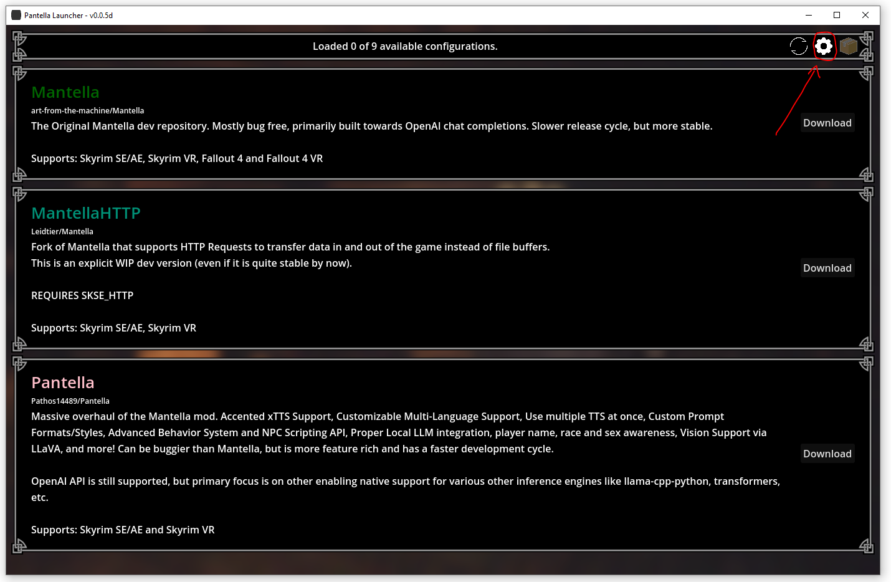
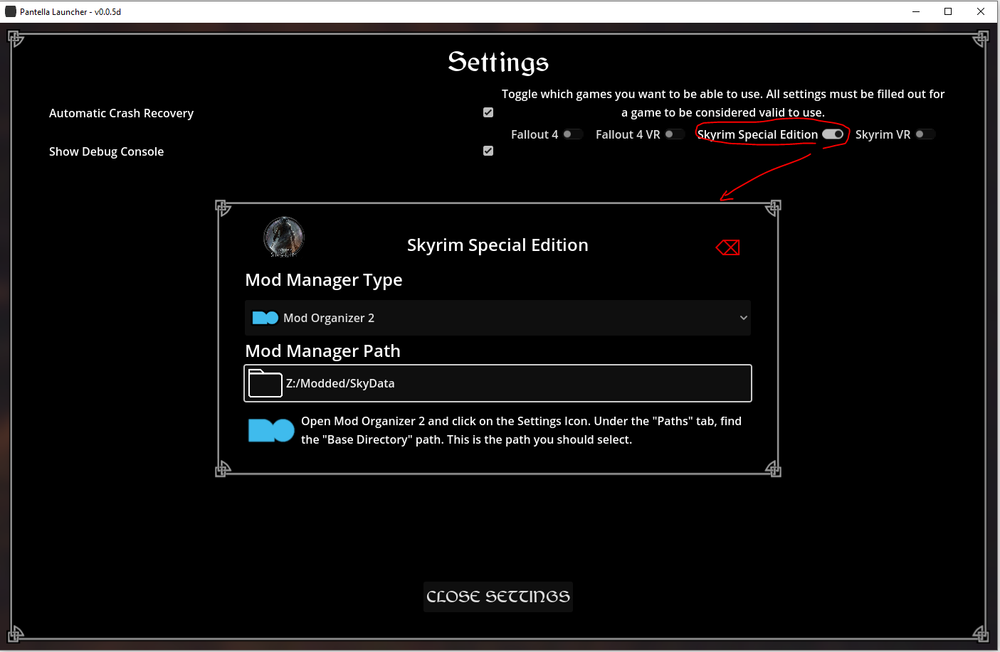
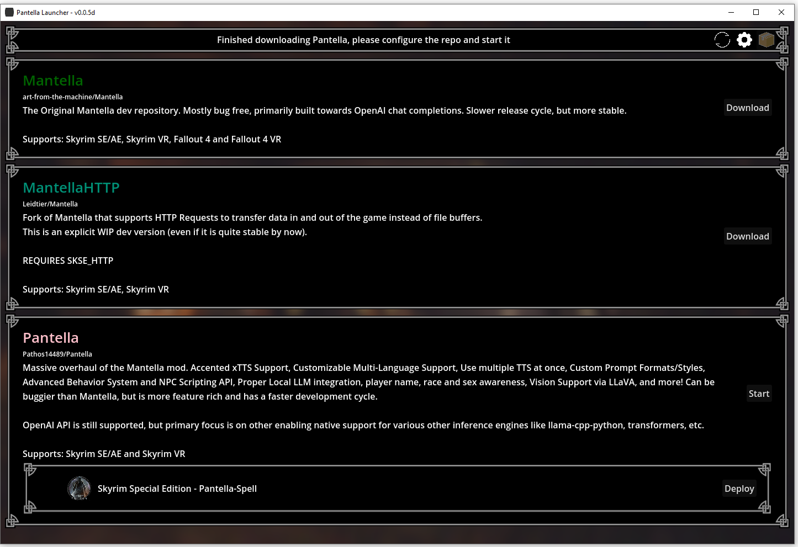
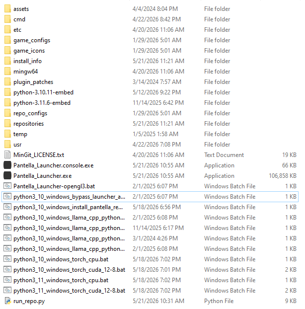
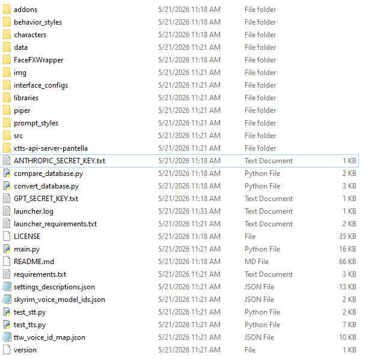

 
 

Pantella is a fork of the popular Skyrim/FO4 mod Mantella, which allows you to naturally speak to NPCs using Speech-to-Text or Text Input, various LLM inference backends/OpenAI API Compatible (text generation), and half a dozen Text to Speech options.

## Key Features
- Interact with 1,000+ NPCs, all with their own unique backgrounds (or [add your own](#adding-new-npcs))
- Support for local (eg Llama 2, 3, 3.1, Gemma, etc.), OpenAI (GPT-4, 4o, etc.), and OpenRouter (Toppy-M 7B, various other LLMs from dozens of providers, including Anthropic, Meta, OpenAI, etc.) language models
- Compatibility with 20+ languages  and support for changing the whole prompt sent to the LLM with the prompt_style settings to the desired language. This should improve the quality of the responses from the LLM when using a language other than English.
- NPCs remember past conversations with you (better than before!)
- NPCs are aware of in-game events, remember them long term, and can take action based on them during conversations
- Vision support for vision based LLMs, both local and cloud based
- Fully playable in Skyrim VR / SE / AE and Fallout New Vegas (plus Tale of Two Wastelands!)

Developer Documentation here: [Pantella Documentation](https://github.com/Pathos14489/Pantella/wiki)

Note: Pantella is not yet bug free or ready for all users. Please read the entire README before installing and reach out on Discord or GitHub if you have any questions or issues. It may have some issues that need to be ironed out, but I'm still working on it and will try to help anyone who needs it.

# Table of Contents
- [Table of Contents](#table-of-contents)
- [Preface - "What's different from Mantella?"](#preface---whats-different-from-mantella)
	- [ChromaDB Memory Manager](#chromadb-memory-manager)
	- [New Behavior System](#new-behavior-system)
	- [Proper Narrative Roleplay Support](#proper-narrative-roleplay-support)
	- [Add-On System](#add-on-system)
	- [Modular Design](#modular-design)
	- [New LLM Backends](#new-llm-backends)
	- [New TTSes](#new-ttses)
		- [TTSes tl;dr](#ttses-tldr)
		- [Other TTS Options](#other-tts-options)
	- [Grammar Restrained Chain-of-Thought Support](#grammar-restrained-chain-of-thought-support)
	- [Automatic Character Generation](#automatic-character-generation)
	- [Supported Games](#supported-games)
- [Requirements](#requirements)
	- [Hardware Requirements](#hardware-requirements)
	- [Storage Requirements](#storage-requirements)
	- [Compatibility](#compatibility)
	- [Game Install Location](#game-install-location)
	- [Picking Your Inference Engine and Language Model (Optional)](#picking-your-inference-engine-and-language-model-optional)
		- [OpenAI Compatible APIs](#openai-compatible-apis)
			- [OpenAI (First $5 Free, but terrible quality)](#openai-first-5-free-but-terrible-quality)
			- [OpenRouter (First $1 Free, Free Models Often Available)](#openrouter-first-1-free-free-models-often-available)
			- [text-generation-webui (Free Local Models)](#text-generation-webui-free-local-models)
			- [koboldcpp (Free Local Models)](#koboldcpp-free-local-models)
			- [koboldcpp Google Colab Notebook (Free Cloud Service, Potentially Spotty Access / Availablity)](#koboldcpp-google-colab-notebook-free-cloud-service-potentially-spotty-access--availablity)
		- [Local LLMs (llama-cpp-python)](#local-llms-llama-cpp-python)
- [Installing Prerequisites](#installing-prerequisites)
	- [1 - Install Git (Optional but Recommended)](#1---install-git-optional-but-recommended)
	- [2w - Install Git for Windows](#2w---install-git-for-windows)
	- [2l - Install Git for Linux](#2l---install-git-for-linux)
	- [3w - Install FFmpeg for Windows (Required for FNV players)](#3w---install-ffmpeg-for-windows-required-for-fnv-players)
	- [3l - Install FFmpeg for Linux(debian) (Required for FNV players)](#3l---install-ffmpeg-for-linuxdebian-required-for-fnv-players)
	- [4 - Install Microsoft C++ Build Tools](#4---install-microsoft-c-build-tools)
		- [4w - Install Microsoft C++ Build Tools for Windows](#4w---install-microsoft-c-build-tools-for-windows)
		- [4l - Install Microsoft C++ Build Tools for Linux](#4l---install-microsoft-c-build-tools-for-linux)
	- [5 - CUDA (Recommended) - Requires NVIDIA GPU](#5---cuda-recommended---requires-nvidia-gpu)
	- [6 - Do you want to use xVASynth? (Optional)](#6---do-you-want-to-use-xvasynth-optional)
	- [7 - Pick a Mod Manager](#7---pick-a-mod-manager)
		- [Mod Organizer 2 (Recommended)](#mod-organizer-2-recommended)
		- [Vortex (Not Recommended)](#vortex-not-recommended)
	- [8 - Install Requirements in Game](#8---install-requirements-in-game)
	- [9 - Restart Your Computer](#9---restart-your-computer)
- [Installation (Launcher)](#installation-launcher)
	- [1 - Getting Started - Installing the Launcher](#1---getting-started---installing-the-launcher)
	- [2 - Configuring the Launcher](#2---configuring-the-launcher)
		- [2.1 - Setting Up Your Game and Mod Manager](#21---setting-up-your-game-and-mod-manager)
		- [2.2 - Downloading the Repository and Deploying the Plugin](#22---downloading-the-repository-and-deploying-the-plugin)
		- [Launcher File Structure Overview](#launcher-file-structure-overview)
		- [Pantella File Structure Overview](#pantella-file-structure-overview)
	- [3 - Run Pantella](#3---run-pantella)
		- [3.1 - Configure LLM Settings](#31---configure-llm-settings)
		- [3.2 - Configure Speech Recognition Settings](#32---configure-speech-recognition-settings)
		- [3.3 - Configure TTS Settings (Optional)](#33---configure-tts-settings-optional)
		- [3.4 - Configure Vision Settings (Optional)](#34---configure-vision-settings-optional)
	- [4 - Have Fun!](#4---have-fun)
- [Installation (Development)](#installation-development)
	- [Adding New NPCs](#adding-new-npcs)
	- [Running with Conda (recommended)](#running-with-conda-recommended)
	- [Running with venv](#running-with-venv)
	- [Running without venv (generally not recommended)](#running-without-venv-generally-not-recommended)
- [Addons](#addons)
	- [Skyrim SE/AE/VR Addons](#skyrim-seaevr-addons)
	- [TTS Addons](#tts-addons)
	- [Inference Engine Addons](#inference-engine-addons)
- [Troubleshooting](#troubleshooting)
	- [ChromaDB Memory Editor](#chromadb-memory-editor)
	- [General Issues Q\&A](#general-issues-qa)
		- [Conversation ends as soon as spell is cast / \[Errno 2\] No such file or directory: 'path\\to\\Skyrim Special Edition/some\_text\_file.txt'](#conversation-ends-as-soon-as-spell-is-cast--errno-2-no-such-file-or-directory-pathtoskyrim-special-editionsome_text_filetxt)
		- [NPCs keep repeating the same line of dialogue](#npcs-keep-repeating-the-same-line-of-dialogue)
		- [No message box displayed to say spell has been added / Pantella Spell is not in spell inventory](#no-message-box-displayed-to-say-spell-has-been-added--pantella-spell-is-not-in-spell-inventory)
		- [Voicelines are being displayed in Pantella but are not being said in-game](#voicelines-are-being-displayed-in-pantella-but-are-not-being-said-in-game)
		- ['Starting conversation with' without the NPC name is displayed ingame and nothing happens after](#starting-conversation-with-without-the-npc-name-is-displayed-ingame-and-nothing-happens-after)
		- [NPCs only respond with "I can't find the right words at the moment."](#npcs-only-respond-with-i-cant-find-the-right-words-at-the-moment)
		- [Microphone is not picking up sound/stuck on "Listening..."](#microphone-is-not-picking-up-soundstuck-on-listening)
		- ['NoneType' object has no attribute 'close' when using Speech-To-Text](#nonetype-object-has-no-attribute-close-when-using-speech-to-text)
		- [RuntimeWarning: Couldn't find ffmpeg or avconv - defaulting to ffmpeg, but may not work](#runtimewarning-couldnt-find-ffmpeg-or-avconv---defaulting-to-ffmpeg-but-may-not-work)
	- [xVASynth Issues](#xvasynth-issues)
		- [RuntimeError('PytorchStreamReader failed reading zip archive: failed finding central directory')](#runtimeerrorpytorchstreamreader-failed-reading-zip-archive-failed-finding-central-directory)
		- [Loading voice model... xVASynth Error: ('Connection aborted.', RemoteDisconnected('Remote end closed connection without response'))](#loading-voice-model-xvasynth-error-connection-aborted-remotedisconnectedremote-end-closed-connection-without-response)
	- [The powershell window opened but isn't doing anything.](#the-powershell-window-opened-but-isnt-doing-anything)
- [FAQ](#faq)
	- [Why does the requirements.txt file include your own forks of existing modules?](#why-does-the-requirementstxt-file-include-your-own-forks-of-existing-modules)
	- [Why do I have to launch the Pantella backend from the launcher and not just start the game like Mantella?](#why-do-i-have-to-launch-the-pantella-backend-from-the-launcher-and-not-just-start-the-game-like-mantella)
		- [But isn't the launcher an exe you're distributing? What's the difference?](#but-isnt-the-launcher-an-exe-youre-distributing-whats-the-difference)
	- [What is this blue terminal window that opens when I download a repository with the launcher?](#what-is-this-blue-terminal-window-that-opens-when-i-download-a-repository-with-the-launcher)
- [Attributions](#attributions)

# Preface - "What's different from Mantella?"
Pantella has been forked from Mantella v0.11 and more or less redesigned from the ground up. A lot of the systems have been broken out into generic modules to make it easier for developers to add new LLM backends, change how conversations are stepped through, etc., without having to redo any of the work for the parts they don't want to replace. It also gives end users much finer control over the exact shape of the prompt sent to the LLM with the prompt_style settings. xTTS and PiperTTS are both included with Pantella by default, and the launcher has been pre-setup to cut out any preparation steps. xVASynth is currently the only TTS that requires extra steps to get working because I can't include it by default.

## ChromaDB Memory Manager 
Pantella has a completely new memory system that depreciates the old summary memory. The new memory uses chromadb to more or less sort everything you've ever said to an NPC into the most relevant chunks of memories. No more lossy summaries that forget details because the LLM doesn't know to include them/can't shove everything into one paragraph.

## New Behavior System
Pantella also has a completely revamped NPC behaviors system that has been made as easy to program for as possible to let the NPC choose to do more complex actions than the pre built "Follow" and "Attack" behaviors from Mantella. Lemme know if you want details on how to make your own behaviors. Pantella Spell also implements an Actor API to let the python behaviors control the Actor in game, though this only runs when the NPC next speaks.

## Proper Narrative Roleplay Support
Pantella additionally has completely reworked generation processing to basically read the output text and figure out which chunks should be spoken by the NPC and which chunks should be read by the new Narrator, which reads roleplayed actions in asterisks by default but can be set to other roleplaying styles in settings. The Narrator is completely customizable, and can be disabled if you prefer the old Narrator-less experience. But I recommend giving it a shot, it's very Baldur's Gate 3-y.

## Add-On System
And Pantella also just got a new add-on system to let other mod authors create self contained patches for Pantella to add voice models, character entries, support for game events for mods and new behaviors, new components like inference engines and TTSes, without having to tinker around in the source much.

## Modular Design
Almost every part of Pantella, including the inference engines(LLM backends), the TTS backends, the memory system, the behavior system and even the game_interface which is used to interact with the game, is broken out into its own module that can easily be replaced with a new module. This makes it easy to add new features to Pantella without having to redo any of the work for the parts you don't want to replace and is the main reason I'm able to add so many new features so quickly. Want to add support for another game? Replace the game_inferface and get the right characters in your characters directory and there you go. New inference engine just dropped and I haven't had time to add it? Adding it yourself from documentation isn't that hard and I'd love to help walk you through how I'd do it if you get stuck(plus if it works, you should PR it <3).

<b>Note</b>: There is still some work to be done to make the game_interface more generic, but it's a start. The character_manager class is also a bit of a mess and could use some work to make it more generic for example, this is definitely still an in progress change still due to the scope of the project.

## New LLM Backends
No more just OpenAI API compatible servers, if you have the computer to run it, you can run the LLM directly in Pantella itself. No 3rd party software or setup required, it works out of the box. llama-cpp-python is built in and allows running GGUF models natively in Pantella. If someone wanted to add vLLM support, or exllama, or any other LLM backend, it would be as easy as adding one new file containing all the inference code, updating the requirements.txt with any new packages that are required and adjusting the config_loader.py file to add any new config settings. Feel free to ask in the Discord if you have a backend you want to add and I can help you get started and help troubleshoot any issues you may have. Additionally, there is support for vision based LLMs now as well.

## New TTSes
Pantella comes with added support for several new TTSes compared to Mantella. Additionally, multiple TTSes can be loaded at once and used in a fallback order. Including the ones in Mantella v0.12, here is a list of all available TTSes in Pantella with their pros and cons:
- <b>PiperTTS</b>(<b style="color:green">Also Available for Mantella</b>) is a fast and really easy to run on most computers. It doesn't require special hardware like a CUDA enabled GPU, runs on CPU, and I've ever managed to run it on my phone via Winlator. It's not the highest quality TTS in my opinion, but it's enabled by default because everything needed to run it is included with Pantella and it's the easiest to run in general. Note: Does not have any voices for Fallout New Vegas or Fallout 3, so it's not recommended to use PiperTTS for Fallout NV/TTW.
- <b>xVASynth</b>(<b style="color:green">Also Available for Mantella</b>) is a TTS that uses the xVASynth engine to generate voices. It's a bit more complicated to set up than the other TTSes, but it's a very good TTS that can run on CPU or GPU fast enough to actually use, and it's the most powerful and flexible TTS available for Pantella. Training new voices does require a pretty decent GPU, but it's possible to train new voices with xVASynth and use them in Pantella pretty easily if you have the hardware. Good for Skyrim, but doesn't have all of the voices for Fallout 3 or New Vegas to properly support Fallout TTW. If you're planning to use Pantella for Fallout TTW, xVASynth is pretty much incompatible with it at this time due to the lack of voice models, less than half of the voice models for Fallout TTW are available for xVASynth at this time. But if you're using Pantella for Skyrim, xVASynth is a very good option for a TTS, especially if you don't have much extra VRAM to spare for TTSes, as it can run on CPU pretty well.
- <b>xTTS 2</b>(<b style="color:green">Also Available for Mantella</b>) is a really good TTS for human sounding voices, but it struggles for dragons, robots, etc. It also is basically unusable on CPU and requires an additional 4GB of VRAM usage on top of your game to run it. And it's slower than xVASynth and PiperTTS. But for the voices it's better for, it's a <b>lot</b> better than xVASynth or PiperTTS. It can be sampled on a short sample between 5-10 seconds with decent quality. It also has an English accent by default, but you can actually change the accent to any of the other supported languages in the settings and override specific characters/races to use specific accents with the prompt_style/character JSON files. 
- <b>StyleTTS2</b> is very similar to xTTS 2, but it's a bit more robotic sounding and has pronounciation issues sometimes. But higher pitch voices, like some female voices, sound a bit better with StyleTTS2 than xTTS 2. It's also a bit faster than xTTS 2, and doesn't require as much VRAM, hovering closer to 3GB of usage. It can be sampled on a short sample between 15-25 seconds with decent quality.
- <b>F5-TTS</b> is a new diffusion based TTS that was released alongside E2 TTS. It only requires like 1-1.5GB of VRAM, and sounds as good or better than xTTS for a lot of voices. It's about the same speed, maybe a little slower, but I could see a few characters getting this one over xTTS or StyleTTS2. It can be sampled on a short sample between 10-15 seconds with decent quality. F5 sounds less robotic than E2.
- <b>E2-TTS</b> is a new Unet based TTS that was released alongside F5 TTS. It only requires like 1-1.5GB of VRAM, and sounds as good or better than xTTS for a lot of voices. It's about the same speed, maybe a little slower than F5-TTS, but I could see a few characters getting this one over xTTS or StyleTTS2. It can be sampled on a short sample between 10-15 seconds with decent quality. E2 sounds more robotic than F5.
- <b>GPT-SoVITS</b> is a Chinese based TTS/voice conversion model that's *very* good for the compute required for it. It only requires 1GB of VRAM, and sounds <i>fantastic</i> on a lot of voices. Anything with a heavy accent seems to be a struggle for it, like Nords and some of the Elves. And it has some pronunciation issues at times. But for the voices and words it's good at, it's genuinely unparalleled in the local space in my opinion and easily surpasses xTTS for those voices.
- <b>Chatterbox</b>(<b style="color:red">new</b>) is a "production-grade open source TTS model. Licensed under MIT, Chatterbox has been benchmarked against leading closed-source systems like ElevenLabs, and is consistently preferred in side-by-side evaluations." Very good emotional tinting in speaking, can do a lot of different voices very well, and isn't unusably slow, though it is a bit slower than xTTS 2 on the same hardware. It needs 6GB of VRAM to run on GPU, but it can run on CPU as well--albiet, very slowly, about five times slower than the GPU(2080 ti) on a Ryzen 9 5950X with DDR4. It's more stable than xTTS and I personally prefer it over most of the other TTSes so far. But it can add strange accents to some voices, likely due to the way it was trained. It can be sampled on a short sample between 5-10 seconds with very good quality, and I haven't had a bad time giving it longer samples either but they rarely seemed to do significantly different and sometimes trended to be worse overall. Consistency is better than xTTS, less modem noises coming out of NPCs. Overall a very good TTS if you can run it.

### <b>TTSes tl;dr</b>
In summary <b>xTTS 2</b> and <b>StyleTTS2</b> are both very good TTSes for a lot of voices, but they require a decent amount of VRAM and are slower than the other options. <b>F5-TTS</b> and <b>E2-TTS</b> are both very good diffusion based TTSes that require much less VRAM and are about the same speed as xTTS, but they can be a bit inconsistent with some voices. <b>GPT-SoVITS</b> is a Chinese based TTS that is very good for the compute required for it, but it struggles with heavy accents and has some pronunciation issues. <b>Chatterbox</b> is a new TTS that is very good for emotional tinting and consistency, but it can add strange accents to some voices and is slower than xTTS on the same hardware. <b>PiperTTS</b> is the easiest to run and included with Pantella by default, but it's not the highest quality TTS. <b>xVASynth</b> is a very good TTS that can run on CPU or GPU, but it doesn't have all the voice models for Fallout TTW so it's not recommended for use with Fallout TTW at this time.

### Other TTS Options
Pantella also has support for other TTS options that aren't included with Pantella by default, like Qwen3 TTS and IndexTTS2, which can be added with the add-on system. Read more about those down [here](#addons).

## Grammar Restrained Chain-of-Thought Support

Pantella supports a special type of response output that does Chain-of-Thought(CoT) in a single prompt. Locally using GBNF grammars, and remotely using response formats on OpenRouter. Only some OpenRouter models are supported by this feature, and it's recommended to use the local models for this feature. This feature is still in development and may not always work as expected. It will also add an inconsistent delay before the character speaks, as it has to go through the thought process before speaking. It's also customizable in the settings, allowing you to architect how NPCs think before they respond to you, and can also be disabled if you don't like it. Operates like reasoning models (GPT o1, DeepSeek r1, etc.) but doesn't require special finetuning to work. I'm not really sure if it's actually improving performance for roleplay, would want to benchmark it, but I find it personally interesting. It has a lot more potential for making tool calling(Behaviors) more powerful, so I'm excited to play with this more in the future.

## Automatic Character Generation

When a character is first encountered, if a character entry is not found in the characters directory, Pantella can automatically generate a character entry for the character. This is done by using the character's name, race, sex, location, etc. to generate a character entry. This feature is still in development and may not always work as expected. This feature also requires your model to support CoT as it relies on using response formats/GBNF grammars to generate the character entry.

##  Supported Games

Pantella currently supports Skyrim Special Edition, Skyrim Anniversary Edition, Skyrim VR, Fallout New Vegas and (technically) Fallout 3 via Tale of Two Wastelands. Support for other games can be added by adding another game_interface module and adding the appropriate character entries to the characters directory. If you want to add support for another game and don't know where to start or what help, feel free to reach out to me on Discord or open an issue on GitHub and we can discuss how to do it. Enderal is also somewhat supported, but there are no character entries for Enderal included with Pantella at this time.

# Requirements
## Hardware Requirements
There are no discovered minimum requirements at the time of writing for Pantella. Pantella needs a certain amount of hardware allocation to run successfully for specific setups though, and if this is being soaked up by other hardware intensive mods, it may crash.

The minimum requirements for xVASynth can be found on its [Steam page](https://store.steampowered.com/app/1765720/xVASynth/). It runs in CPU mode by default, using a single CPU core/thread. Only supports GPU acceleration on NVIDIA cards that have CUDA. Using the same GPU as the game will produce stutter, especially if it can't allocate ~2 GB of VRAM. You may try using an older NVIDIA card that has CUDA on another free PCI-Express slot of your PC and run any CUDA enabled services on that.

If you're trying to minimize the amount of compute needed to run Pantella, I'd advise using xVASynth or PiperTTS (if your selected game supports these TTSes) and using Open Router. This should provide the easiest to run experience.

It's highly recommended to have at least 16 GB of RAM to run Pantella even with an inference provider, and to install it on an SSD if possible. It will have major latency issues if installed on an HDD, but it should still work. If you're using a local LLM, the hardware requirements will depend on the model you're using, but generally, you'll want a pretty powerful GPU with a good amount of VRAM to run local models, especially if you're using one of the larger models. Running local models on CPU is generally not recommended unless you have a very powerful CPU and are using a smaller model, and even then, it may struggle to keep up with the pace of a conversation in game.

## Storage Requirements
Pantella requires around 4-6 GB of storage space and includes the voice models/latents for PiperTTS, and xTTS_api out of the box. xVASynth requires around 4 GB of storage space for the software itself and after downloading all the voice models for Skyrim and Fallout New Vegas I have used around 38 GB of storage space. If you're using a local language model, you'll have to factor in the size of the model you're using yourself. But suffice to say, you'll need a fair amount of storage space to run Pantella with all the bells and whistles.

## Compatibility
- Pantella works on Windows 10, Windows 11 and Debian Linux (it is yet unconfirmed whether it works on Windows 7)

## Game Install Location
As Pantella accesses and writes to files within your game if choice's folder, it is unlikely to work correctly if your game is installedin Program Files(as is typical with normal Steam installations). Please ensure that you have your game stored outside of this folder (Such as C:\Games\Steam for example).

If you use the Steam version of Skyrim or Fallout New Vegas, then note that Steam does not allow to move the old or create a new Steam Game Library on the same disk partition by simply ignoring the attempt to do so. You either move the whole Steam client outside [as described on this Steam Support page](https://help.steampowered.com/en/faqs/view/4BD4-4528-6B2E-8327) or use [LostDragonist/steam-library-setup-tool](https://github.com/LostDragonist/steam-library-setup-tool/wiki/Usage-Guide) to create a Steam Game Library besides another.

## Picking Your Inference Engine and Language Model (Optional)
There are a number of different LLMs to choose from, ranging from small local models to expensive externally hosted models. Note that some smaller models may struggle to handle long term conversations or may say the wrong thing at the wrong time. If you just want to get started without thinking too much about it / explore alternative options later and are new to Pantella, skip to the [next step](#1---getting-started---installing-the-launcher).

### OpenAI Compatible APIs
#### OpenAI (First $5 Free, but terrible quality)
Copy your OpenAI secret API key (see [here](https://help.openai.com/en/articles/4936850-where-do-i-find-my-secret-api-key) if you need help finding it (you will need to set up an account if you haven't already) and paste into `PantellaSoftware/addons/openai_api/OPENAI_API_SECRET_KEY.txt`. Do not share this key with anyone. While there is a free trial, you will need to set up your payment details for the API to work. OpenAI is NOT recommended, their API is very limited, and their content policy is utterly draconian. Please use any other option, literally any other option.

#### OpenRouter (First $1 Free, Free Models Often Available)
Create an account with OpenRouter. Go to the "Keys" tab and generate a new key, saving its value to `PantellaSoftware/addons/openai_api/OPENAI_API_SECRET_KEY.txt`. Do not share this secret key with anyone. In your associated `[game_id]_config.json`, set `model` to a model from the list [here](https://openrouter.ai/docs#models) (eg `meta-llama/llama-3.3-70b-instruct:free`). Set `alternative_openai_api_base` to "https://openrouter.ai/api/v1" (without quotes).

#### text-generation-webui (Free Local Models)
Install text-generation-webui from [here](https://github.com/oobabooga/text-generation-webui). Place a local model into the `text-generation-webui\models folder` (to get started, you can download `toppy-m-7b.Q4_K_S.gguf` from [here](https://huggingface.co/TheBloke/Toppy-M-7B-GGUF/tree/main?not-for-all-audiences=true)). Paste the text "--extensions openai --auto-launch" (as well as "--cpu" for CPU users) into the installed folder's CMD_FLAGS.txt file. Start text-generation-webui and wait for the UI to open in your web browser. Navigate to the "Model" tab, select your model from the drop-down list, and click "Load". In your `[game_id]_config.json` file, set `alternative_openai_api_base` to "http://127.0.0.1:5000/v1" (without quotes). Just to note, you need to make sure text-generation-webui is running when running Pantella!

#### koboldcpp (Free Local Models)
Install koboldcpp's latest release from here: https://github.com/LostRuins/koboldcpp/releases.  If you have an nvidia gpu with cuda support, download the koboldcpp.exe file.  If you do not or do not want to use cuda support, download the koboldcpp_nocuda.exe.  Download it outside of your Skyrim, Fallout New Vegas, xVASynth or pantella folders.  Download a local large language model, such as `toppy-m-7b.Q4_K_S.gguf` from [here](https://huggingface.co/TheBloke/Toppy-M-7B-GGUF/tree/main?not-for-all-audiences=true).  Save that somewhere you can easily find it, again outside of Skyrim, Fallout New Vegas, xVASynth or pantella.  Run the koboldcpp.exe.  When presented with the launch window, drag the "Context Size" slider to 4096.  Click the "Browse" button next to the "Model:" field and select the model you downloaded.  Under the presets drop down at the top, choose either Use CLBlas, or Use CuBlas (if using Cuda).  You will then see a field for GPU Layers. If you want to use CPU only leave it at 0.  If you want to use your GPU, you can experiement with how many "layers" to offload to your GPU based on your system.  Then click "Launch" in the bottom right corner.  In your `[game_id]_config.json` file, set `alternative_openai_api_base` to "http://localhost:5001/v1" (without quotes).  Just to note, you need to make sure koboldcpp is running when running Pantella!

#### koboldcpp Google Colab Notebook (Free Cloud Service, Potentially Spotty Access / Availablity)
This option does not require a powerful computer to run a large language model, because it runs in the google cloud.  It is free and easy to use, and can handle most .gguf models that are up to 13B parameters with Q4_K_M quantization all on the free T4 GPU you get with google colab.  The downside is Google controls dynamically when the GPUs are available and could throttle your access at any time, so it may not always work / be available.  To use this method, go to this web page: https://colab.research.google.com/github/LostRuins/koboldcpp/blob/concedo/colab.ipynb.  Click the play button that appears below the text "Enter your model below and then click this to start Koboldcpp."  Wait until text stops generating (probably will take a minute or two).  You should see a URL link near the end of the text after a statement like "Connect to the link below," with a silly name, in a format like https://its-taking-time-indeed.trycloudflare.com.  You may want to click on the link just to ensure koboldcpp pops up to ensure its ready before proceeding.  Select that link and copy it with CTRL+C.  In your `[game_id]_config.json` file, set `alternative_openai_api_base` to that URL by pasting it, and then add /v1 at the end. So it will look something like alternative_openai_api_base = https://its-taking-time-indeed.trycloudflare.com/v1.  Make sure to keep your browser open to the koboldcpp colab notebook while using Pantella so it does not turn off.  If you want to choose a different llm model to use with this method, make sure it is a .gguf model and follow the instructions on the colab to do so.  Be sure to close your browser tab once you've finished your Pantella session, to free up the GPU and help avoid hitting Google's usage limits.

### Local LLMs (llama-cpp-python)
If you have a powerful computer, you can run a local LLM. This is the most powerful and flexible option, but it requires a lot of resources. For example, you can run a local LLM using the llama-cpp-python backend. To do this, you will need to install the llama-cpp-python backend by running the script included with the launcher for your specific setup/hardware. You will also need to download a local model, such as `toppy-m-7b.Q4_K_S.gguf` from [here](https://huggingface.co/TheBloke/Toppy-M-7B-GGUF/tree/main?not-for-all-audiences=true). Once you have the model, set `model_path` to the path to the model in your `[game_id]_config.json` file, and it should be good to go.

# Installing Prerequisites

## 1 - Install Git (Optional but Recommended)
Pantella optionally requires git to be installed to perform all updates correctly. If you don't intend to update your installation, you can skip this step. This is required even if using the launcher. If you try to run the `./install_pantella_requirements.bat` script without git installed, it will fail immediately without an error message(unless you run the bat file in the terminal). If you failed an update because you don't have git installed, simply install git and then run the `./install_pantella_requirements.bat` script to fix your installation and get the latest updates.

## 2w - Install Git for Windows
1. Download the latest version of Git for Windows from [here](https://git-scm.com/download/win).
2. Run the installer and follow the instructions. The default settings should be fine.

## 2l - Install Git for Linux
Hah! You're probably already done with this part! Git is installed by default on most Linux distributions. If you don't have it, you can install it with `sudo apt install git` or `sudo yum install git` or `sudo pacman -S git` depending on your distribution.

## 3w - Install FFmpeg for Windows (Required for FNV players)
The easiest way to install FFmpeg on Windows is to install it via Chocolatey. You can certainly download the compiled build from ffmpegs site and add it to the system path, but I feel like that's not exactly approachable to everyone.

1. To install Chocolatey, follow their Individual Use installation guide over here: [Install Chocolatey](https://chocolatey.org/install) You should just have to run the command they recommend.
2. Then to install ffmpeg with chocolatey, run `choco install ffmpeg` in the same terminal you just used to install Chocolatey.
3. Restart your computer to ensure the changes take effect and are usable by Pantella.

## 3l - Install FFmpeg for Linux(debian) (Required for FNV players)
This is super simple. It might already come installed on your distro of choice, but if it doesn't, simply run `sudo apt install ffmpeg`.

## 4 - Install Microsoft C++ Build Tools
Pantella requires the Microsoft C++ Build Tools to be installed to build some of the required Python packages to install/reinstall them. If you don't have this installed, you can install it by following the instructions below. If the requirements change over time, and you continue to receive updates for Pantella, you will need to install the Build Tools to keep up with the changes. It will try to automatically update your requirements whenever new requirements are added, but if it fails to do so, you may see error messages and no longer be able to run Pantella until you install the Build Tools and install the latest requirements. If you try to run the `./install_pantella_requirements.bat` script without the Build Tools installed, it will fail immediately with an error message about the Build Tools not being installed. If you failed an update because you don't have the Build Tools installed, simply install the Build Tools and then run the `./install_pantella_requirements.bat` script to fix your installation and get the latest updates.

### 4w - Install Microsoft C++ Build Tools for Windows
1. Download the latest version of the Microsoft C++ Build Tools from [here](https://visualstudio.microsoft.com/visual-cpp-build-tools/).
2. Follow the instructions to install the Build Tools from the top answer over here: [Install Build Tools](https://stackoverflow.com/questions/64261546/how-to-solve-error-microsoft-visual-c-14-0-or-greater-is-required-when-inst)
2. Run the installer and follow the instructions. The default settings should be fine.

### 4l - Install Microsoft C++ Build Tools for Linux
You're probably already done with this part too. Microsoft C++ Build Tools are not required on Linux.

## 5 - CUDA (Recommended) - Requires NVIDIA GPU

If you want to use F5-TTS, E2 TTS, StyleTTS2, OuteTTS, ParlerTTS, ChatTTS, or xTTS 2 with GPU acceleration, you will need to have CUDA installed on your system. If you don't have CUDA installed, you can skip this step and use PiperTTS or xVASynth instead.

1. Download CUDA 12.8 from [here](https://developer.nvidia.com/cuda-12-8-2-download-archive). 
2. Run the installer and follow the instructions. The default settings should be fine.

Newer versions of CUDA may work, but you'll have to test them yourself and install torch for your CUDA version. Newer versions of torch may not work with Pantella, so it's recommended to stick with CUDA 12.8 for now as it's the most tested version of CUDA with Pantella at this time. Long term I'd love to support newer versions of CUDA, but for now, if you want to use CUDA acceleration with Pantella, it's recommended to use CUDA 12.8. Make sure to select the correct version for your operating system and architecture. If you are trying to use a newer version of CUDA, you can try it out and see if it works with Pantella, and if you have any issues, feel free to reach out to me on Discord or GitHub and I can try to help you troubleshoot any issues you may have with using a newer version of CUDA with Pantella.

## 6 - Do you want to use xVASynth? (Optional)
xVASynth is a very good Text-To-Speech software that can be used by Pantella for Skyrim and partially for Fallout New Vegas. It is available on [Steam](https://store.steampowered.com/app/1765720/xVASynth/) and [Nexus](https://www.nexusmods.com/skyrimspecialedition/mods/44184). It is recommended to download it via Steam, as it is easier to update and manage. If you are using the Nexus version, do not store xVASynth in your Skyrim folder. It is NOT recommended to use xVASynth for Fallout New Vegas or Tale of Two Wastelands at this time due to the lack of voice models for Fallout, which will result in a lot of NPCs sounding the same and not having the correct voices. There are *some* voices for Fallout New Vegas, but it's less than half of the voices needed to properly support Fallout TTW. For Fallout, it's recommended to use a voice cloning TTS like xTTS 2, StyleTTS2, etc. and pair that with voice samples for all the voice models for Fallout New Vegas/Fallout 3 to get the best experience. For Skyrim, xVASynth is a very good option for a TTS, especially if you don't have much extra VRAM to spare for TTSes, as it can run on CPU pretty well and has voice models for almost every character in the game.
1. Download xVASynth via [Steam](https://store.steampowered.com/app/1765720/xVASynth/) or [Nexus](https://www.nexusmods.com/skyrimspecialedition/mods/44184). Do not store xVASynth in your Skyrim folder.

2. Download xVASynth trained voice models of Skyrim for all or any characters that you are likely to encounter. If downloading all models sounds a bit daunting, you can start with the "Male Nord" and "Male Soldier" voice models to at least allow talking to Skyrim guards. You can either download all models via a torrent, via the xVASynth UI if you have Nexus Premium, or manually via the Nexus Mods page.  

	

	
<b>xVASynth Model Installation Options</b>
  

   	#### 💎 Nexus Premium (Quickest)  
   	If you are subscribed to Nexus Premium, open the xVASynth UI and select "Get More Voices" from the bottom left corner. Unselect all games except for Skyrim/Fallout NV/3, hit check now and download all models. Note that this may require restarting xVASynth, re-check nowing, and restarting the download a few times for the downloads to properly complete, they like to just stop downloading for no discernable reason and then restarting the download seems to fix it.

   	#### 🌊 Torrent (Slowest, Easiest)  
   	Voice models can be downloaded via a single torrent. Torrents can be downloaded via Bittorent clients such as [qBittorent](https://www.qbittorrent.org/download). Note that download speeds vary depending on the time of day. Paste the below magnet link in your browser to receive a popup to open it via your Bittorent client, and set the download location to your_xVASynth_folder/resources/app/models/skyrim:  

   	`magnet:?xt=urn:btih:798BB3190E776BFDCF590910C0805656420F45BC&dn=skyrim&tr=udp%3a%2f%2ftracker.opentrackr.org%3a1337&tr=udp%3a%2f%2fexplodie.org%3a6969&tr=wss%3a%2f%2ftracker.btorrent.xyz&tr=wss%3a%2f%2ftracker.openwebtorrent.com`  

   	Note that this magnet URI may be removed from this page if any voice model becomes unavailable on Nexus Mods.  
   
	#### 🛠️ Manual (Hardest)  
   	If you do not have Nexus Premium, or if the torrent is not available, you can also download the voice models directly from Nexus [here](https://www.nexusmods.com/skyrimspecialedition/mods/44184?tab=files) (under "Optional", not "Old). Once you have manually downloaded each voice model into a folder, open xVASynth and drag all zipped voice model files from this folder into the voices panel. Wait for the installation to complete (this may take some time; a popup will display when finished saying "x models installed successfully"). If this method doesn't work for you, you can also unzip the models manually into the correct xVASynth folder (xVASynth\resources\app\models\skyrim). Once the extraction is complete, you can delete the zipped voice model files.  
	  
	

3. Download the .lip plugin for xVASynth [here](https://www.nexusmods.com/skyrimspecialedition/mods/55605) and download FaceFXWrapper from [here](https://www.nexusmods.com/skyrimspecialedition/mods/20061) (you do not need to download CK64Fixes). Instructions on how to install these are on the .lip plugin Nexus page. Make sure to place FaceFXWrapper in the plugins folder as stated on the .lip plugin page.

4. Download the Elder Scrolls pronunciation dictionary from [here](https://www.nexusmods.com/skyrimspecialedition/mods/56778/), and follow the instructions to install.

5. In the xVASynth UI, if "Skyrim" is not already selected, please do so by clicking the arrows symbol in the top left corner. On the navigation bar on the top right of the xVASynth UI, click on the "ae" icon. Once opened, click on the CMUDict dictionary and select "Enable All" in the bottom left corner. Do the same for "xVADict - Elder Scrolls" received from the above step.

Make absolutely sure xVASynth isn't already running when Pantella starts unless it's running in headless mode. It will error out if it's already running when Pantella tries to start it in headless mode. If you want to use the xVASynth UI, you can start it after Pantella has started and it should work fine.

## 7 - Pick a Mod Manager

Pantella supports Mod Organizer 2 and Vortex. If you don't have a mod manager, you can download one of these. Mod Organizer 2 is generally recommended because it doesn't argue with you about how Pantella Launcher deploys the plugins into it's mod directories. Vortex on the other hand, you will have to restart Vortex after each update/deployment, and when you do so it's going to show a popup scolding you for letting the Launcher touch it's precious files. If you have a mod manager already, make sure to set it up in the launcher settings before deploying the plugin, but just be aware that Vortex is going to be very angry with you and there's not a single thing I or you can do about it.

### Mod Organizer 2 (Recommended)

MO2 can be downloaded from [here](https://www.nexusmods.com/skyrimspecialedition/mods/6194).

### Vortex (Not Recommended)
Vortex can be downloaded from [here](https://www.nexusmods.com/site/mods/1).

## 8 - Install Requirements in Game

Depending on which game you want to get Pantella working for, you will need to install the required mods for the in-game plugin to function. You can see the required mods for each plugin on the plugin github page:

- [PantellaNV](https://github.com/Pathos14489/PantellaNV) for Fallout New Vegas
- [Pantella Spell](https://github.com/Pathos14489/Pantella-Spell) for Skyrim SE/AE/VR

Note: Don't install the plugins from the above pages yet, just the requirements. The plugins themselves will be installed via the launcher in the next steps. You can install them manually, but the launcher will automatically install them for you and keep them updated, so it's recommended to just install the requirements manually and let the launcher handle the plugins themselves.

## 9 - Restart Your Computer

After installing the above requirements, it's required to restart your computer to ensure all the changes take effect and are usable by Pantella. If you don't restart your computer, you may encounter errors when trying to run Pantella, and it may not work correctly until you do. Especially for FFmpeg and the Microsoft C++ Build Tools, a restart is required for them to work correctly with Pantella.

# Installation (Launcher)
## 1 - Getting Started - Installing the Launcher

First things first, you'll need the latest launcher. You can find that here: https://github.com/Pathos14489/Pantella-Launcher/releases

First click on the latest release under Releases. And follow the installation instructions for the launcher on the release. The instructions will likely be something like this:
1. Download `PL-v0.0.7.7z` and extract it where you want Pantella to be installed.
2. Download the Python environment necessary for your repo of choice. You can download only one or both, but at least one of them is necessary for the launcher to uh, do anything.
	- **Pantella** requires `python-3.10.11-embed.7z`.
	- **Mantella** requires `python-3.11.6-embed.7z`. 
I recommend somewhere on the same drive as your game of choice, this will reduce latency caused by moving the voicelines from Pantella into the game directory, and also likely reduce how many writes are occurring to your drives, but somewhere like your desktop is also probably fine if you only use SSDs. Once you've unpacked the release, go open the launcher.

## 2 - Configuring the Launcher

### 2.1 - Setting Up Your Game and Mod Manager

When you first open the launcher, you'll see a bunch of repositories available to download. Don't touch them yet. First, click up here on the settings button:

Enable a game and configure the settings for that game.  Here's an example of how my Mod Organizer 2 config looks in the launcher:

### 2.2 - Downloading the Repository and Deploying the Plugin

Close settings and download the repository of Mantella/Pantella you want to use(we're going to assume you want to use Pantella). For support using other forks, please go ask for it in their server(s) unless the problem is definitely an issue with the launcher. Note that the repositories are all subject to live updates, and may not run on a given update if the committer wasn't careful/they're not maintaining a stable main branch(guilty as charged). This is not the launcher's fault, this is not the other developers fault, this might be my fault, but this is just the pain of using the live updated source code. Please bear with us, change hurts(especially if you like throwing your spare change at people) and takes time. ❤️

After it's done downloading, your front menu should look like this:

If your plugins haven't appeared with a deploy button, please restart the launcher. If they still don't appear, reach out for support, that's a bug with the launcher and we want to help fix it. If they have appeared, please click deploy on the plugin of your choice. If you're using Mod Organizer 2, you might have to click this button to refresh your modslist:

If you're using Vortex, tough luck, restart your mod manager and get yelled at for not using it the way they wanted you to.
If your plugin doesn't appear in your mod manager, again this is a bug, please reach out. You can test this by either checking the folder directly, or check if the plugin deploy button is available to click on a launcher restart. If it is, it's failing to deploy the plugin and again we want to help you, so please reach out about this.

### Launcher File Structure Overview

Next I'd like to explain the basic structure of the launcher directory. Your final launcher directory should now look like this: 

This is your launcher's root directory. If you're using llama-cpp-python, or LLaVA, you'll want to install the correct version using the included bat files now. If you have Show Debug Console enabled in settings, it will open a console that lets you read along with Pantella as it processes your requests. Useful for debugging. Then click start for Pantella in the launcher. If you have Automatic Crash Recovery enabled in the launcher settings page. The console window that opens will always restart if it closes for any reason. This is an intentional feature, not a flaw. If you don't like it, turn it off. The first launcher of Pantella will error out, but it has to generate some config files for you, first. So please let it error out once.

Now navigate from your launcher directory, to `./repositories/Pathos14489_Pantella/` where we can finally start configuring Pantella itself for how you intend to use it!

### Pantella File Structure Overview

First, another look to make sure our Pantella repository folders look the same. If you notice any differences, you might have either a newer version than is depicted here, an older version, or something went horribly wrong. Try updating just incase, and failing that, feel free to reach out for support on the Discord if anything looks too different from here:

 

Note from pre-tester: This is a good time to get a bagel to reward yourself.

## 3 - Run Pantella

Now just click start for Pantella and let it perform first time set up. It will popup a bunch of windows and ask you to input a lot of stuff, this is expected, just follow the instructions on the windows and input the requested information. If you have any issues, please reach out on the Discord. We're here to help.

### 3.1 - Configure LLM Settings

After you decide on type of LLM you want to use, we're going to assume you left it on the default, which is `openai_api` with the OpenRouter API using `meta-llama/llama-3.3-70b-instruct:free`. If you want to use a different LLM from OpenRouter, you can change the `model` and `alternative_openai_api_base` settings in your `[game_id]_config.json` file or set it during first time setup. If you want to change the inference engine, you can set `inference_engine` in your `[game_id]_config.json` file to either `koboldcpp` or `text-generation-webui`. If you're using a local model, you'll need to set the path to the model in your `[game_id]_config.json` file. If you're using OpenRouter, you'll need to set the `model` to a model from the list [here](https://openrouter.ai/docs#models) (eg `meta-llama/llama-3.3-70b-instruct:free`). Set `alternative_openai_api_base` to "https://openrouter.ai/api/v1/" (it's already set by default, so if you haven't changed it, you shouldn't have to do anything here.)
If you're using OpenRouter, you'll need to create an account with OpenRouter. Go to the "Keys" tab when you hover over your user icon at the top right while logged in and generate a new key, saving its value to `./GPT_SECRET_KEY.txt`. Do not share this secret key with anyone as it's effectively your login information for OpenRouter.

### 3.2 - Configure Speech Recognition Settings

Do you intend to use Speech-To-Text? If so, you'll need to set up your speech recognition settings as it's disabled by default. Set `stt_enabled` to `true` to enable the speech to text. Then in game in the MCM menu, if this is your first time running Pantella on a save, you will have to toggle the microphone off/on again. I'm not sure why, will fix later. It's somehow bugged halfway on and off such that neither will work. Toggling it will reset it to the correct state and then you may use the microphone as intended or use text input if you prefer.

### 3.3 - Configure TTS Settings (Optional)
By default PiperTTS is set to be used, and it can cover 90% of the voices in Skyrim. If you want to use a different TTS, you can change the `tts_engine` setting in your `[game_id]_config.json` file to either `xtts_api`, `style_tts_2`, `xvasynth`, etc., or select a TTS during first time setup. Check the available TTS options. If you're using xVASynth, you'll need to set the path to the xVASynth executable in your `[game_id]_config.json` file. If you're using PiperTTS, you don't need to do anything here. Read about the pros and cons of the various TTS options [here](#new-ttses).

### 3.4 - Configure Vision Settings (Optional)

Normally you won't be using this. Most cloud based models are not very good at vision. OpenAI compatible chat completion with vision is supported, but the LLaVA support via `llama-cpp-python` is far better and I recommend using it instead if you want to use vision. If you're trying to use it, set `vision_enabled` to `true` in your `[game_id]_config.json` file. If you're using LLaVA, you'll need to set the inference engine to `llama-cpp-python`

## 4 - Have Fun!
You should be good to go! Whenever you want to use Pantella, please start the launcher, and click start for Pantella. If you have any issues, please reach out on the Discord. We're here to help. Note: Vision support has to be started after the game Window is already open, and might depend on windowed/windowed borderless mode to work correctly. It's not completely solid yet, and might have some bugs. If you're having issues with vision, try changing your game to windowed mode or reach out in the Discord. On the first time you load Pantella into your save, even on a new game, load in, save, and reload the save you just made to initialize the plugin.

# Installation (Development)
The source code for Pantella is included in this repo. Here are the quick steps to get set up:

## Adding New NPCs
Pantella allows you to talk to any NPC, but expects you to make sure they're set up(Or use a model that supports character generation!). If you start a Pantella conversation with an unknown/unsupported NPC (eg a modded NPC), Pantella will typically error and you will be asked to fill out the character information for this character.

Of course, if you are unhappy with Pantella's assumptions, you can add full support for modded NPCs to `./characters/[game_id]/` by adding a new JSON file containing the NPC's name (`name`), `base_id`, `ref_id`(the IDs are optional but very recommended!) background description (`bio`), and voice model (`voice_model`). You can also add this as an addon pack released seperate from Pantella, and users can download it and place it in the `./addons/` folder to add support for the modded NPC. Check the Developer Documentation for more information on how to do this and for the format of the JSON file.

Note that if the modded NPC is custom voiced there may not be a model available, and you will either need to assign the NPC a vanilla voice, or use a voice sampling TTS and provide a voice sample in `./data/voice_samples/`.

For further support and examples of how other users have added modded NPCs, ask in the [Discord](https://discord.gg/M7Zw8mBY6r).

## Running with Conda (recommended)
1. Clone the repo to your machine
2. Create a conda environment via `conda create -n pantella python=3.10` in your console
3. Start the environment in your console (`conda activate pantella`)
4. Install the required packages via `pip install -r requirements.txt`
5. Run Pantella via `main.py` in the parent directory and follow the first time setup instructions like normal.

## Running with venv
1. Clone the repo to your machine
2. Create a virtual environment via `py -3.10 -m venv PantellaEnv` in your console (Pantella requires Python 3.10.11, I've not had a chance to test it with 3.11 yet)
3. Start the environment in your console (`.\PantellaEnv\Scripts\Activate`)
4. Install the required packages via `pip install -r requirements.txt`
5. Run Pantella via `main.py` in the parent directory and follow the first time setup instructions like normal.

## Running without venv (generally not recommended)
1. Clone the repo to your machine
2. Install the required packages via `pip install -r requirements.txt`
3. Run Pantella via `main.py` in the parent directory and follow the first time setup instructions like normal.

If you have any trouble in getting the repo set up, please reach out on [Discord](https://discord.gg/M7Zw8mBY6r)!

# Addons

## Skyrim SE/AE/VR Addons

[PantellaSL](https://github.com/Pathos14489/PantellaSL) adds (basic) SexLab integration for Skyrim SE/VR/AE and operates as a demonstration of how to add support for another mod as an addon to Pantella.

## TTS Addons
[Pantella-qwen_3_tts](https://github.com/Pathos14489/Pantella-qwen_3_tts) adds Qwen3TTS as a TTS option to Pantella in the form of an addon. Made to demonstrate how to add a TTS as an addon, and because of the License possibly being in conflict with the Pantella license? Wasn't sure, erred on the side of caution. Works pretty good, about on par with Chatterbox.

[Pantella-indextts2](https://github.com/Pathos14489/Pantella-indextts2) adds IndexTTS2 as a TTS option to Pantella in the form of an addon. Made to demonstrate how to add a TTS as an addon and because it's kinda mid for a number of reasons. The emotion of this TTS is very expressive, but the flow of english dialogue can be rather stilted, and the dependencies required are kinda hard to fit with the rest of Pantella in a way that they can all work together properly. (It requires a really new version of transformers that breaks a lot of the older TTSes.) I mainly separeted this one because of the dependency issues, but also because of the somewhat experimental nature of the TTS itself. It doesn't sound *bad* per se, and I would like to hear it in game before passing judgement fully, but the somewhat stilted english dialogue is a bit of a red flag for me and the built in qwen emotion support is a bit of a double edged sword. It's nice that it can sound more emotional, but the emotion doesn't always fit the context of the dialogue, and it can make some lines sound pretty distorted. Still, it's an interesting TTS and I'm curious to see how it performs in game. I'm thinking I could maybe tie it into the torchmoji emojis generated for chromadb(finally a reason to use those besides just thinking they're neat!) to try to help it pick more fitting emotions, but we'll see.

[Pantella-depreciated_ttses](https://github.com/Pathos14489/Pantella-depreciated_ttses) adds a number of older TTSes that have been removed from the main Pantella repository for various reasons, but are still available to use as addons if you want to use them.

## Inference Engine Addons

[Pantella-player2](https://github.com/CarlosNahuelcoy/Pantella-player2) (By Gerik Uylerk) adds support for the Player2 inference API and STT API.

# Troubleshooting
## ChromaDB Memory Editor

Something you might have noticed coming from `summarizing_memory` like Mantella's, is that ChromaDB doesn't store everything in plain text. It's actually kind of a pain in the ass to edit it. As such, I've made a basic memory editor for the ChromaDB memories and included it as a web UI with Pantella. When Pantella is open, and the setting is enabled(it is by default) go to `http://localhost:8022` in your browser to access the memory editor. You can use this to edit memories, delete memories, and add new memories. It's a bit basic, but it should be enough to let you fix any major issues that come up.

## General Issues Q&A

Click to expand

### Conversation ends as soon as spell is cast / [Errno 2] No such file or directory: 'path\to\Skyrim Special Edition/some_text_file.txt' 
This is either an issue with the path set for `skyrim_folder` in `[game_id]_config.json`, an issue with your Skyrim folder being in Program Files, an issue with the installation of PapyrusUtil, or you are not running Skyrim via SKSE (please see the included readme.txt file in SKSE's downloaded folder for instructions on how to use it). 

Some VR users miss that there is a separate VR version of PapyrusUtil, double check that you have downloaded this version of the mod if you are a VR user (it should be under the Miscallaneous Files section of the Nexus download page). To put it another way, if you have `PapyrusUtil AE SE - Scripting Utility Function` in your modlist, you have the wrong version. 

If you are an SE user, please double check your Skyrim version by right-clicking its exe file in your Skyrim folder and going to Properties -> Details. The "File version" should be listed here. If it is 1.6 or above, you actually have Skyrim AE, not SE (its confusing I know), so please download the AE versions of the required mods. You can tell if PapyrusUtil is working by checking if you have a file called `_pantella_skyrim_folder.txt` in your `skyrim_folder` path.

If you have the required mods installed, then this issue might instead be caused by the `skyrim_folder` being set incorrectly. This only seems to be an issue for Mod Organizer 2 / Wabbajack modlist users. Some Mod Organizer 2 setups move the text files created by the Pantella spell to another folder. Try searching for a folder called overwrite/root or "Stock Game" in your Mod Organizer 2 / Wabbajack installation path to try to find these Pantella text files, specifically a file called `_pantella_skyrim_folder.txt`. If you find this file, then please set its folder as your `skyrim_folder` path.

### NPCs keep repeating the same line of dialogue
Try using the button labeled `Fix multiple NPC repeating lines bug` in the MCM to fix this. Basically if your game or Pantella crashes, it will leave the Pantella Spell effect on the NPC and stop tracking them, and thus, won't remove the effect when you end the conversation. This button will remove the effect from all NPCs nearby(or in the game, not sure) and should fix the issue.

### No message box displayed to say spell has been added / Pantella Spell is not in spell inventory
This is an issue with the way the spell mod itself has been installed. Please check your Skyrim version by right-clicking its exe file in your Skyrim folder and going to Properties -> Details. The "File version" should be listed here. If it is 1.6 or above, you have Skyrim AE. If it is below 1.6, you have Skyrim SE. If you are using VR, there are separate versions of the required mods for VR (PapyrusUtil tends to catch out a lot of VR users, the VR version of this file is under "Miscellaneous Files" on the download page). If you are running the mod via the GOG version of Skyrim, there are slight differences in setting up a mod manager as discussed in [this tutorial](https://www.youtube.com/watch?v=EJYddISZdeo).

If you're using a Skyrim version older than 1.6.1130, please use either one of these mods to add ESL support to your game:
[Backported Extended ESL Support](https://www.nexusmods.com/skyrimspecialedition/mods/106441) or [Skyrim VR ESL Support](https://www.nexusmods.com/skyrimspecialedition/mods/106712/)

### Voicelines are being displayed in Pantella but are not being said in-game
Try creating a save and then reloading that save. This ensures that the Pantella voice files get registered correctly by the game engine. 

If the above fails, a more unlikely reason for voicelines not playing is if you have updated the Pantella spell with a more recent version by replacing files in the mod's folder. If this is the case, open Skyrim, end all Pantella conversations and unequip the Pantella spell, and create a save. In your mod organizer, disable the Pantella spell plugin. Open your newly created save and create another save (now with no Pantella mod). Finally, in your mod organizer re-enable the Pantella spell plugin. This should effectively "reset" the mod. When you next open your recent save, you should see a notification that the Pantella spell has been added to your inventory.

### 'Starting conversation with' without the NPC name is displayed ingame and nothing happens after
If you're playing Skyrim, make sure Skyrim Script Extender (SKSE) is started before Skyrim itself.
[SKSE ReadME](https://skse.silverlock.org/skse_readme.txt)

If you'e playnig Fallout New Vegas, check that the requirements are installed. If they are, please reach out for support on the Discord.

### NPCs only respond with "I can't find the right words at the moment."
This means there's an error with the language model. Please check your `logging.log` file for more information on what the error is. If you are still unsure, please share your `logging.log` file to the Discord and ask for help!

### Microphone is not picking up sound/stuck on "Listening..."
Make sure that your mic is picking up correctly on other software and that it is set as your default. For example, you can go to User Settings -> Voice & Video on Discord to test your mic. Otherwise, try adjusting the `audio_threshold` setting in `[game_id]_config.json`. If all else fails, make sure that no other microphones are plugged in except the one you want to use. There may be a rogue microphone such as a webcam picking up as your default!

### 'NoneType' object has no attribute 'close' when using Speech-To-Text
This error means that Whisper is unable to find a connected microphone. Please ensure that you have a working microphone plugged in and enabled.

### RuntimeWarning: Couldn't find ffmpeg or avconv - defaulting to ffmpeg, but may not work
xVASynth related warning when started by Pantella. Thus far has not impacted Pantella so it can be safely ignored.

## xVASynth Issues

Click to expand

### RuntimeError('PytorchStreamReader failed reading zip archive: failed finding central directory')
If an xVASynth voice model is corrupted, this error will display in `logging.log`. Please re-download the voice model in this case. You may alternatively need to redownload xVASynth.

A way to check for other corrupted voice models, is to compare the file sizes within /models/skyrim/ folder of xVASynth. If they diverge from the norms, redownload **just** those. The norms for voice model sizes are **~54 MB** and/or **~90 MB** (v2 voice models) & **~220 MB** or **~260 MB** (v3 voice models)

### Loading voice model... xVASynth Error: ('Connection aborted.', RemoteDisconnected('Remote end closed connection without response'))
If this xVASynth Error occurs after the "Loading voice model..." message (as can be seen in your `logging.log` file), this is likely an issue with a corrupted voice model. Please try redownloading the model from [here](https://www.nexusmods.com/skyrimspecialedition/mods/44184). If you have `use_cleanup` enabled, try setting this value to 0 in `[game_id]_config.json`.

If this does not resolve your issue, please share the text found in your xVASynth/server.log file on the [Discord's #i-need-help forum channel](https://discord.gg/M7Zw8mBY6r) for further support.

## The powershell window opened but isn't doing anything.
Check the window title and see if it starts with "Select", if it does, right click in the window to stop selecting and allow the command to run. This is a quirk of powershell where if you accidentally click in the window, it will stop the command from running until you right click to stop selecting. If this doesn't work, please reach out for support on the Discord.

# FAQ

Frequently Asked Questions about Pantella. If you have a question that isn't answered here, please ask in the [Discord](https://discord.gg/M7Zw8mBY6r) and we will add it to the FAQ if it's a common question!

## Why does the requirements.txt file include your own forks of existing modules?

The requirements.txt file includes my own forks of existing modules because I have had to make a few compatibility changes to these modules to get them to work with all of the various parts of Pantella. I guarantee if you go look through the commits on the forks, almost all of the changes are just loosening up their setup.py, pyproject.toml and requirements.txt files to allow for more flexible versions of a bunch of other modules to be installed, and in a few rare cases some code changes to support newer versions of some of the packages.

## Why do I have to launch the Pantella backend from the launcher and not just start the game like Mantella?

I wanted to make the development process easier and remove compiling the python to an exe from the process entirely. This lets end users add addons and modify the code more easily, and also makes it easier for me to update the code and push those updates to users without them having to redownload an entire exe every time. Additionally, I just find distributing the code in this way more enjoyable, and less sketchy than distributing an exe.

### But isn't the launcher an exe you're distributing? What's the difference?

The launcher is compiled to an exe, yes, but the source for building the launcher yourself exists in the [Pantella Launcher repo](https://github.com/Pathos14489/Pantella-Launcher). You can build the launcher yourself if you want, fork it, modify it, etc. I actually forked Mantella in the first place because I didn't like the exe that the dev didn't want to tell people how to compile themselves, it sketched me out. I'm not claiming I think Mantella's dev is sketchy, I just prefer to distribute software in a way that is more transparent and gives users more control because I'm a paranoid person who doesn't like running random exes from the internet even if they're probably completely fine.

## What is this blue terminal window that opens when I download a repository with the launcher?
That's powershell. The launcher is using powershell to run `git clone` and then `git pull` commands to download and update the repositories. If you see this window, it means the launcher is downloading or updating the repository you selected. If you close this window while it's open, it will likely cause issues with the repository download/update, so I recommend just leaving it open until it closes on its own.

# Attributions
Pantella uses material from the "[Skyrim: Characters](https://elderscrolls.fandom.com/wiki/Category:Skyrim:_Characters)" articles on the [Elder Scrolls wiki](https://elderscrolls.fandom.com/wiki/The_Elder_Scrolls_Wiki), [Fallout New Vegas: Characters](https://fallout.fandom.com/wiki/Fallout:_New_Vegas_characters) and [Fallout 3: Characters](https://fallout.fandom.com/wiki/Fallout_3_characters) articles on the [Fallout wiki](https://fallout.fandom.com/wiki/Fallout_Wiki) at [Fandom](https://www.fandom.com/) and is licensed under the [Creative Commons Attribution-Share Alike License](https://creativecommons.org/licenses/by-sa/3.0/).

Huge thanks to the original developers of Mantella for the excellent foundation they provided. The original Mantella repo can be found [here](https://github.com/art-from-the-machine/Mantella). And thanks to MrHaurrus for his work on xtts-api-server-mantella that the fork I included with Pantella is based on. The original repo can be found [here](https://github.com/Haurrus/xtts-api-server-mantella). Massive thanks to the authors of the [GECK Wiki](https://geckwiki.com/) for their very well written documentation for NVSE, JIP LN, ShowOff and JohnnyGuitar. 
